# Senior DS — Visual Diagnosis Bank (124 Challenges)
> **What this is.** The fourth companion file: *read-the-plot* challenges. Each item is a figure with a planted, ground-truth pathology (all data synthetic, seeded) plus the question you ask the candidate, the diagnosis, and the fix. This is the skill interviews rarely test but seniors use daily: looking at a chart and naming the disease.
>
> **How to run one.** Show the figure only. Ask the *Ask* line. Let them narrate. Strong candidates describe the shape, name the pathology, state the mechanism, and propose both the fix and the check that confirms it. Great ones also say what monitoring would have caught it earlier.
>
> **Difficulty:** `M` core round · `H` senior signal.

---

## Domain A — Time Series & Demand Patterns

**1. Six customer demand series — diagnose each panel** · `H`
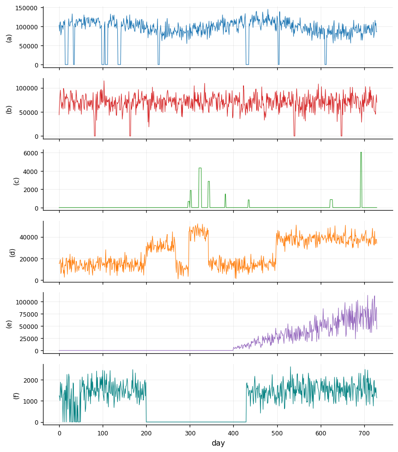
**Ask:** Six B2B customers' daily order volume over two years. Diagnose each panel and state the modeling implication.
**Diagnosis:** (a) Healthy volume with hard drops to exactly zero for multi-day runs: stockouts / supply censoring, not demand — training on raw zeros teaches the model that demand vanished. (b) Stationary but heavy volatility with occasional zeros: usable as-is, but variance calls for robust/quantile loss. (c) Intermittent-lumpy: mostly zeros with rare bursts — continuous-error models and MAPE are undefined/meaningless here. (d) Step-like level regimes: distribution-changing customer (contract renegotiations); a global model without changepoints averages regimes. (e) Late onset: all-zero until mid-history then ramps — a new customer; pre-launch zeros are structural, not demand. (f) Low-volume with a long dormancy gap then reactivation: churn/reactivation dynamics, candidate for a two-stage (active? × how much?) model.
**Fix / next step:** Segment series by pattern before modeling; impute/censor stockout zeros (flag from inventory data); use zero-inflated/Croston-style models for (c); changepoint-aware features for (d); mask pre-launch history for (e); two-stage hurdle model for (f). One global seasonal model over all six is the junior mistake.
**Senior tell:** Distinguishing zero = 'no demand' from zero = 'couldn't supply' (censoring) — panel (a) vs (c).

**2. Forecast keeps missing after a shift** · `M`
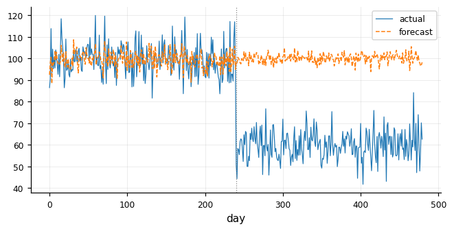
**Ask:** Actual daily volume (blue) and the production model's forecast (dashed). What happened, and why is the model blind to it?
**Diagnosis:** A structural level shift (~day 240, e.g. contract change or lost key account) dropped the mean from ~100 to ~60. The model — trained on the old regime with long history and strong mean reversion — keeps forecasting the old level; every post-shift forecast is biased high by the same offset.
**Fix / next step:** Changepoint detection to trigger re-fitting or regime dummies; shorten/decay the training window; monitor rolling bias (mean error), which flips from ~0 to a constant offset instantly at the break — the alert that should have fired.
**Senior tell:** Naming rolling *bias* (not RMSE) as the monitor that catches this in days.

**3. Variance grows with the level** · `M`
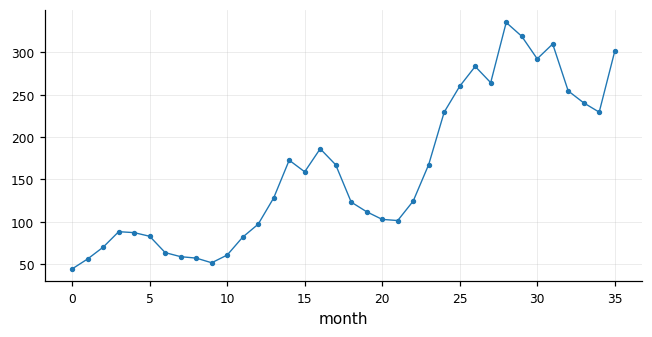
**Ask:** Three years of monthly sales. What property of this series will break an additive model with MSE loss?
**Diagnosis:** Multiplicative seasonality/noise: swing amplitude scales with the level (small early, huge late). An additive model underfits early years and MSE is dominated by late high-level months — errors are heteroscedastic by construction.
**Fix / next step:** Model in log space (or use a multiplicative decomposition / GLM with log link); if forecasting totals, apply a retransformation (smearing) correction when exponentiating back.
**Senior tell:** Connecting log-space training to the retransformation bias it introduces on the way back.

**4. Mostly zeros** · `M`
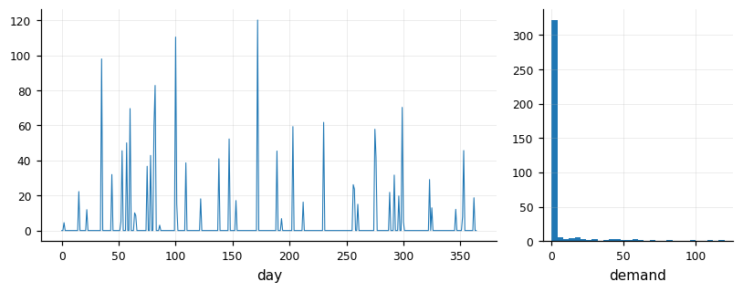
**Ask:** A SKU's daily demand (left) and its histogram (right). The team reports 210% MAPE and wants a 'better model'. What's wrong with the ask?
**Diagnosis:** Intermittent demand: ~85% zeros with rare lumpy bursts. MAPE divides by actuals — undefined on zero days, explosive on small ones — so the metric, not just the model, is broken. A continuous point forecast near zero is also arguably 'optimal' under MSE yet useless for stocking decisions.
**Fix / next step:** Switch family: Croston/SBA, zero-inflated or hurdle models, or forecast the (interval, size) pair; evaluate with WAPE at aggregate level, pinball loss on quantiles, or service-level metrics. Decide at the order-cycle grain, not daily.

**5. The forecast that tracks 'perfectly'** · `H`
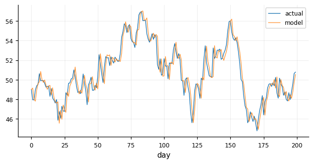
**Ask:** The new model's one-step forecast overlaid on actuals. The junior reports 'it tracks almost perfectly — ship it.' What do you check before agreeing?
**Diagnosis:** The forecast is (almost) the actual shifted by one step — the model has learned persistence (ŷ_t ≈ y_{t-1}), which any random walk delivers for free. Overlays hide this; the eye reads the lag as skill.
**Fix / next step:** Scatter ŷ_t vs y_{t-1} (near-perfect line = mimic); compare against the naive lag-1 baseline (skill score); evaluate at horizon > 1, where a persistence mimic collapses; check whether errors cluster exactly at turning points.
**Senior tell:** Asking for the naive-baseline comparison *before* praising any overlay plot.

**6. Spiky truth, flat prediction** · `M`
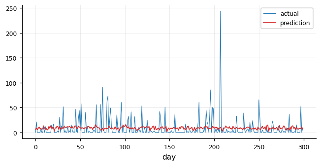
**Ask:** Actuals (blue) vs model predictions (red) for a skewed demand target. Name the failure and its root cause.
**Diagnosis:** Mean collapse: the target is zero-heavy/right-skewed, and MSE-optimal behavior is to predict near the conditional mean — a flat line through the bulk, missing every spike. Typical when likelihood doesn't match the data (Gaussian on zero-inflated skew).
**Fix / next step:** Match the likelihood: Tweedie/negative-binomial or a two-stage hurdle; quantile (pinball) loss if the business needs upper quantiles for stocking; per-segment models. Don't just 'add features' — the loss is the cause.
**Senior tell:** Blaming the *likelihood mismatch*, not the architecture.

**7. Anomaly detector flags the same weeks every year** · `M`
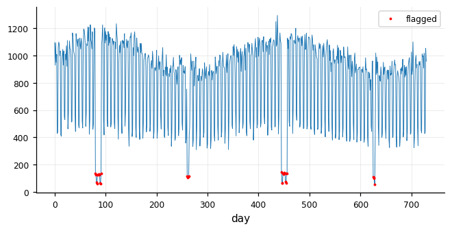
**Ask:** Daily volume with the anomaly detector's flags (red dots). The on-call keeps getting paged. Diagnose.
**Diagnosis:** The 'anomalies' are calendar effects — recurring holiday shutdowns (deep dips at fixed dates) plus weekly seasonality the detector never modeled. A threshold on raw values (or residuals from a non-seasonal model) fires on structure, not surprise.
**Fix / next step:** Model expected value with weekly + holiday calendars (or STL-decompose) and alert on residuals; maintain a holiday feature table (regional calendar matters); suppress known events. Alert fatigue is a modeling bug, not an ops problem.

**8. Great in-sample, useless out** · `M`
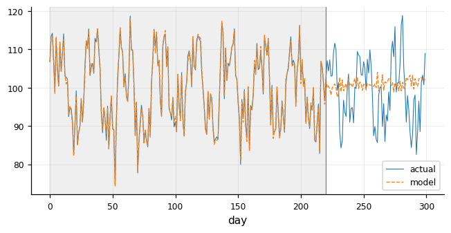
**Ask:** Model fit: shaded region is training, right of the line is the holdout. What went wrong?
**Diagnosis:** Classic overfit-to-history: in-sample the model traces every wiggle (high-order AR / too many features memorizing noise); out-of-sample it degenerates to a drifting mean because the memorized patterns don't repeat. In-sample fit was the selection criterion — that's the process bug.
**Fix / next step:** Select on rolling-origin (time-series CV) error, never in-sample fit; regularize/limit lags; compare to naive & seasonal-naive baselines; keep a strictly untouched final holdout.

**9. Same series, two grains** · `M`
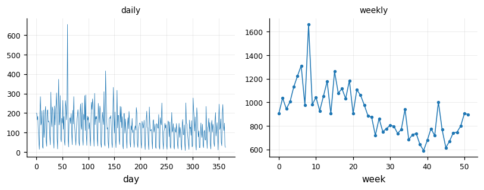
**Ask:** Daily (left) vs weekly-aggregated (right) views of the same demand. The team models daily and reports terrible accuracy. Advice?
**Diagnosis:** Daily is dominated by idiosyncratic noise and day-of-week routing artifacts; weekly aggregation cancels most of it, revealing clean trend/seasonality. If decisions (replenishment, capacity) are weekly, modeling daily adds error and effort for nothing — forecastability improves with aggregation.
**Fix / next step:** Match the modeling grain to the decision grain (or forecast weekly and disaggregate with historical day-of-week shares); check forecastability at each grain (e.g., naive-baseline error ratio) before choosing.

**10. Comb-shaped series** · `M`
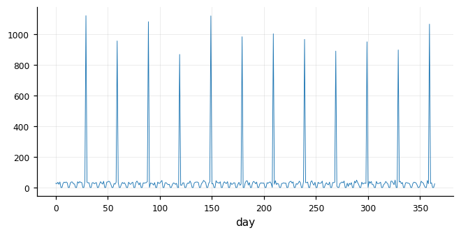
**Ask:** Order volume for a B2B account. Describe the structure and what a model must respect.
**Diagnosis:** A month-end spike comb: the customer batches orders at closing (huge spikes every ~30 days), near-zero between, plus weekend zeros. The 'series' is really an event process driven by the customer's purchasing calendar, not a smooth demand signal.
**Fix / next step:** Feature the business calendar explicitly (days-to-month-end, fiscal cycles); or model order events (timing) and size separately; aggregation to monthly may dissolve the problem entirely. Interpolating between spikes would fabricate demand.

**11. Déjà vu in the history** · `H`
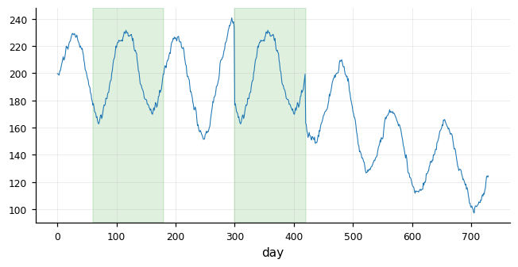
**Ask:** Two years of daily sensor/sales data pulled from the warehouse. Something about this history should stop you from training. What?
**Diagnosis:** An exact repeated segment: days ~300–420 are a byte-identical copy of days ~60–180 (same waveform twice) — a backfill/ETL copy-paste bug, not real data. Any model trained on it learns phantom regularity; CV folds containing both copies leak.
**Fix / next step:** Detect via rolling autocorrelation spikes / exact-window hashing / duplicate-row checks in the pipeline; fix upstream, quarantine the fabricated window, and add a data-quality test (no long exact-duplicate runs) to CI.
**Senior tell:** Reaching for *data provenance* ('when was this backfilled?') instead of modeling around it.

**12. The peak hour that moved** · `M`
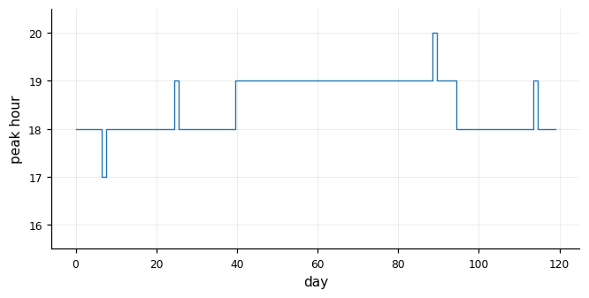
**Ask:** Daily peak-load *hour* extracted from an hourly series, across 120 days. Why did the peak 'move', and what's the real bug?
**Diagnosis:** The peak hour jumps by exactly one hour on a fixed date and back later — a DST/timezone handling bug: timestamps stored in local time (or mixed UTC/local) shift the apparent peak; 23- and 25-hour days corrupt daily aggregates too.
**Fix / next step:** Store and compute in UTC, convert for display; use timezone-aware datetimes; audit daily row counts (23/24/25) around transitions; re-run aggregates after the fix.

**13. The forecast that leaves the data** · `M`
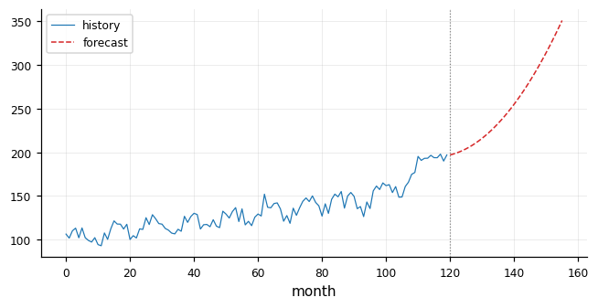
**Ask:** History (blue) and the model's 12-month forecast (dashed). What's wrong with the picture?
**Diagnosis:** Unconstrained trend extrapolation: an exponential/quadratic fit to the recent upswing is projected far beyond the data's support, forecasting ~3× current volume with no saturation logic. Nothing in the history supports that curvature continuing; growth curves saturate (capacity, market size).
**Fix / next step:** Damped-trend models, logistic/saturating growth with a capacity prior, or forecast bounds from domain constraints; judge models on holdout *horizons*, not in-sample fit; any forecast leaving the historical envelope needs an explicit mechanism, not a polynomial.

**14. One point owns the chart** · `M`
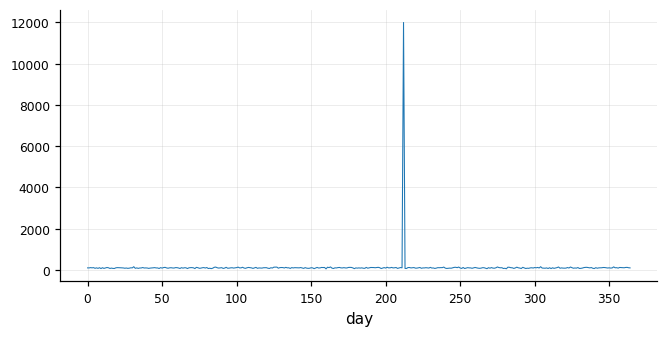
**Ask:** Daily sales as pulled from the warehouse. Before modeling anything — what must happen first?
**Diagnosis:** A single observation (~12,000 vs a ~100-baseline) compresses the entire series into a flat line: almost certainly a data error (unit mistake — order in units vs cartons, currency, duplicated batch) rather than demand. Left in, it dominates MSE, wrecks scalers (min-max especially), and distorts any outlier-sensitive fit.
**Fix / next step:** Trace the point to source records before deciding: correct if error, cap/model separately if a real bulk event; add automated range/z-score validation in ingestion so a 100× point never reaches training silently.

**15. Same mean, new variance** · `M`
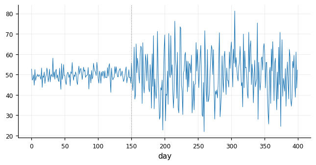
**Ask:** A demand series. The mean forecast is still accurate; the business complains anyway. What changed?
**Diagnosis:** A volatility regime shift: after ~day 150 the level is unchanged but variance roughly quadruples. Point forecasts stay fine while prediction intervals (built on old variance) are far too narrow — safety stock, staffing, and risk decisions built on them now fail routinely.
**Fix / next step:** Model variance explicitly (GARCH-style, or quantile models re-fit on recent windows); monitor rolling variance alongside rolling bias; communicate forecasts as intervals so 'accuracy' includes calibration of uncertainty, not just the mean.

**16. Suspiciously flat weeks** · `M`
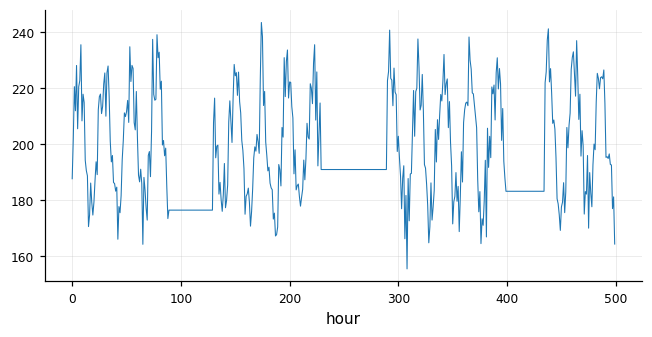
**Ask:** Warehouse extract of hourly throughput. What are the flat segments, and why do they poison a model?
**Diagnosis:** Perfectly constant multi-day runs aren't real operations — they're forward-filled gaps: the sensor/ETL dropped data and someone (or the pipeline) imputed with ffill. A model trained on them learns phantom stability, autocorrelation is inflated, and anomaly detectors are blinded during exactly the failure windows.
**Fix / next step:** Detect via zero-variance run-length checks; carry an explicit `imputed` flag column; either mask imputed spans from training or use an imputation that respects variance; fix the upstream drop.
**Senior tell:** Asking for the missing-data mask instead of accepting the filled series at face value.

**17. Flat-topped peaks** · `M`
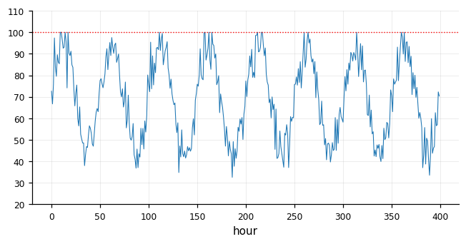
**Ask:** Utilization data feeding a capacity model. What is the plot's key feature and its consequence?
**Diagnosis:** Saturation/censoring: every peak is clipped at exactly 100 — the sensor (or the resource itself) caps there, so true peak demand above the ceiling is unobserved. A model trained on this systematically underestimates peak demand; 'demand at capacity' is a censored quantity, not the real maximum.
**Fix / next step:** Treat as censored data: tobit-style/censored likelihoods or model the exceedance probability; use auxiliary signals (queue lengths, rejects, overflow) to recover the latent peak; never estimate capacity needs from a series that can't exceed capacity.

**18. Every month ends badly** · `M`
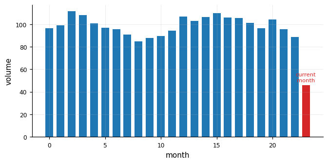
**Ask:** Monthly volume bars from the BI dashboard, pulled today (mid-month). Leadership sees the last bar and asks what went wrong. Answer them.
**Diagnosis:** Nothing went wrong: the last bar is the *current, incomplete* month — roughly half the days have happened, so it shows roughly half the volume. This artifact re-scares someone every single period; it also silently poisons models if partial periods enter training data.
**Fix / next step:** Dashboards: exclude or visually mark incomplete periods, or show run-rate projection. Pipelines: filter partial periods from training and from year-over-year comparisons. Add 'period completeness' as a data-quality dimension.

**19. r = 0.96** · `M`
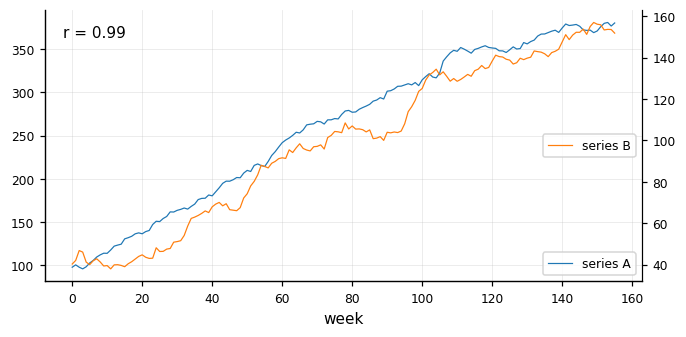
**Ask:** Two business series over three years; the analyst reports r = 0.96 and proposes using one to predict the other. Push back.
**Diagnosis:** Both series simply trend upward — any two trending series correlate near 1 regardless of any real relationship (spurious regression). The correlation measures shared drift, not co-movement; a model built on it collapses the moment either trend bends.
**Fix / next step:** Correlate *changes* (difference/detrend first) or use proper cointegration tests; require an economic mechanism before a predictive claim; out-of-time validation across a trend change is the acid test.
**Senior tell:** Asking for the correlation of first differences before entertaining the claim.

**20. 'Deseasonalized' — but is it?** · `M`
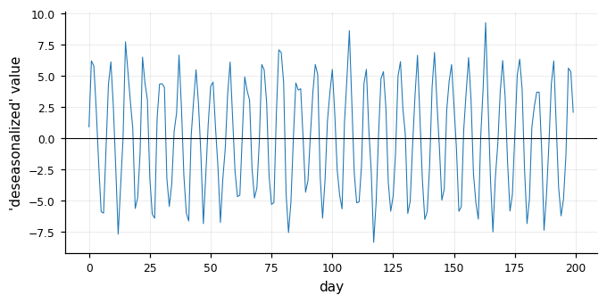
**Ask:** The team removed seasonality (they subtracted a 30-day moving average) and shows you the 'clean' residual, ready for modeling. Inspect.
**Diagnosis:** A clear ~7-day oscillation survives: the actual seasonality is weekly, and subtracting a 30-day average removes slow level, not the weekly cycle. The 'deseasonalized' series still carries its strongest periodic component; any 'trend' model on it will chase the weekly wave.
**Fix / next step:** Identify the true period first (ACF/periodogram), then decompose with that period (STL with period=7, or day-of-week effects in the model); verify by re-plotting the residual ACF — flat at lag 7 or it isn't done.

**21. The 95% band that isn't** · `H`
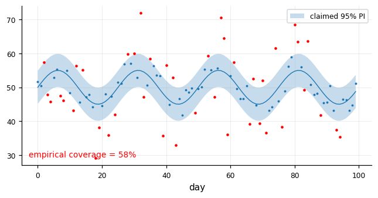
**Ask:** Forecast with its 95% prediction interval vs realized actuals. Formally assess the interval.
**Diagnosis:** Empirical coverage is ~58%: far more than 5% of actuals fall outside the band. The intervals are decorative — variance was underestimated (residual variance from an overfit training window, ignored parameter uncertainty, or Gaussian assumption on heavy-tailed errors). Every downstream decision sized on these bands carries hidden risk.
**Fix / next step:** Backtest coverage explicitly (it's one line of code) and publish it next to the interval; widen via conformal prediction or empirical-quantile residuals; heavy tails → quantile regression. An interval without a measured coverage number is a claim, not a statistic.
**Senior tell:** Immediately computing empirical coverage instead of debating the model.

**22. The dip that moves** · `H`
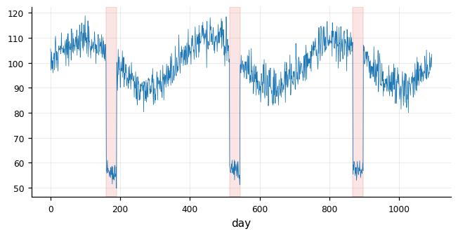
**Ask:** Three years of daily volume. The seasonal model (fit with fixed calendar-date seasonality) misses the marked dips every year. Why?
**Diagnosis:** The dip shifts ~11 days earlier each year — a lunar-calendar event (e.g., Ramadan) drifting against the Gregorian calendar. Fixed day-of-year seasonality can't represent it: the model averages the dip across shifting positions and misses it everywhere, worst around the event itself.
**Fix / next step:** Add moving-holiday regressors from the correct calendar (Hijri/lunar dates as features or holiday windows); libraries and holiday tables exist for this; validate on event-window error specifically. Regional calendars are a modeling requirement, not an edge case.
**Senior tell:** Recognizing the ~11-day annual drift as lunar-calendar signature on sight.

**23. Demand fell — or was pushed?** · `M`
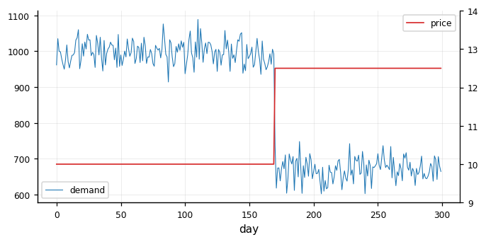
**Ask:** Demand (blue, left axis) and unit price (red, right axis) for a SKU. The forecasting team, whose model has no price feature, calls this a 'structural demand decline'. Assess.
**Diagnosis:** Demand steps down on exactly the day price stepped up — this is price elasticity, not autonomous decline. A model without price sees an unexplained break, adapts its level, and will then miss the recovery if price ever normalizes; worse, planners may cut supply for 'declining' demand they themselves could restore.
**Fix / next step:** Add price (and promo) as causal regressors; estimate elasticity from these natural experiments; separate baseline demand from price/promo effects in the decomposition so scenario questions ('what if we roll back the increase?') become answerable.

**24. Up and to the right** · `M`
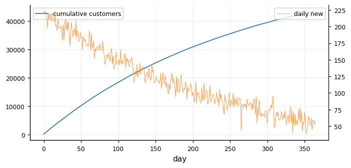
**Ask:** The growth slide: cumulative registered customers. The daily view (orange, right axis) is in the appendix. Which chart tells the truth?
**Diagnosis:** Cumulative counts *cannot decrease*, so the blue curve looks like healthy growth even while the orange daily rate has been falling for months — the cumulative chart's slope is flattening, but slopes are hard to read. This is the standard way declining businesses look fine on stage.
**Fix / next step:** Report rates (daily/weekly adds) and their trend, or at least plot the cumulative curve's derivative; for dashboards, never let a cumulative metric be the only view. 'Is the slope increasing?' is the only honest question a cumulative chart can answer.

---

## Domain B — Training Dynamics & Loss Curves

**25. Train vs validation loss** · `M`
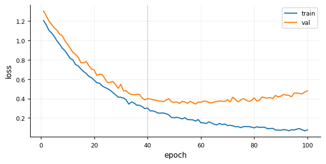
**Ask:** Standard training curves. Read them: what's happening, and what do you do?
**Diagnosis:** Textbook overfitting: train loss decreases monotonically; validation tracks it until ~epoch 40, then rises steadily while train keeps improving — the model is memorizing. The best model is at the val minimum, not the last epoch.
**Fix / next step:** Early stopping on validation (with patience), then regularize (weight decay, dropout, augmentation) or reduce capacity / add data to push the divergence point later. Also confirm the val set is large enough that the minimum isn't noise.

**26. Two broken runs** · `M`
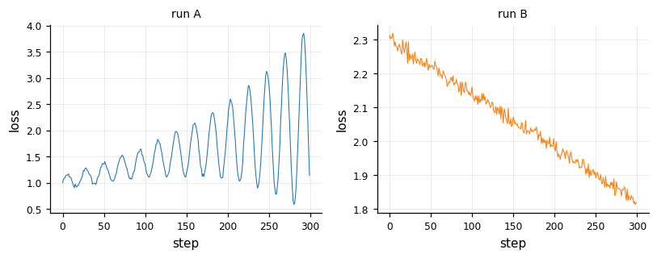
**Ask:** Two training runs, same model, different learning rates. Diagnose each.
**Diagnosis:** Left: loss oscillates with growing amplitude and diverges — LR far too high; steps overshoot the minimum and bounce out of the basin (watch for it going NaN next). Right: loss creeps down almost linearly and is nowhere near converged after the budget — LR too low (or LR after warmup never raised), wasting compute.
**Fix / next step:** LR range test (sweep LR, plot loss); use warmup + a schedule; gradient clipping contains the left case's spikes but doesn't fix the base LR. Loss-curve *shape* is the fastest LR debugger there is.

**27. Loss spikes that recover** · `M`
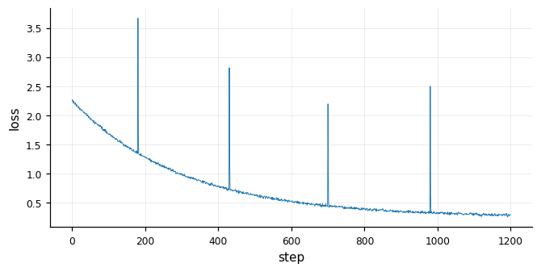
**Ask:** Smooth descent punctuated by huge one-step spikes that mostly recover. Causes and fixes?
**Diagnosis:** Sporadic loss explosions: typical causes are corrupt/outlier samples or mislabeled batches, numerical edge cases (log of ~0, division), too-high LR interacting with heavy-tail gradients, or (in fp16) overflow on rare batches. Recovery suggests isolated bad batches rather than a broken model.
**Fix / next step:** Log the offending batch indices at spike steps and inspect the data; add gradient clipping; sanity-check preprocessing (NaN/inf guards); for fp16 use loss scaling. If a spike doesn't recover, checkpoint-restore + skip the batch.
**Senior tell:** First move is *log which batch spiked* — data inspection before hyperparameter blame.

**28. The cliff into NaN** · `M`
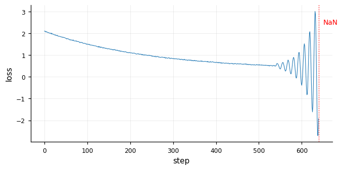
**Ask:** Loss descends, destabilizes, then the curve simply stops at step ~640. What happened and how do you localize it?
**Diagnosis:** Loss went NaN/inf: after growing oscillation (instability), an overflow or invalid op (log(0), 0/0, exp overflow — classically in fp16, attention logits or a bad normalization) poisoned the weights; every subsequent value is NaN so nothing plots.
**Fix / next step:** Enable anomaly detection (torch.autograd.set_detect_anomaly) to find the op; add eps guards in logs/divisions; clip gradients; lower LR / add warmup; in mixed precision use dynamic loss scaling; assert torch.isfinite on loss each step so you fail fast with context.

**29. Validation loss below training loss** · `H`
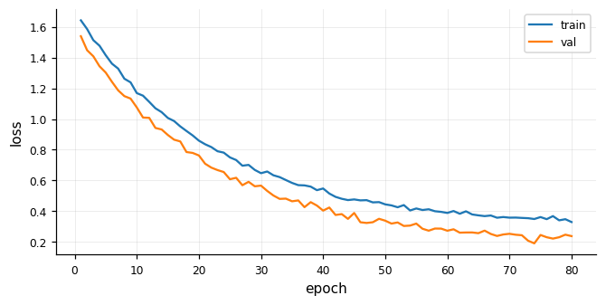
**Ask:** Val loss sits consistently *below* train loss for the whole run. The junior says the plot must be mislabeled. Give the benign explanations and the alarming one.
**Diagnosis:** Benign: (1) regularization asymmetry — dropout/augmentation/label smoothing active on train but off at eval; (2) train loss averaged *during* the epoch (older weights) vs val at epoch end; (3) small-sample noise in an easy/small val set. Alarming: (4) leakage — val rows duplicated in train or preprocessing fit on val; (5) distribution mismatch making val genuinely easier (non-representative split).
**Fix / next step:** Re-evaluate train loss in eval mode on a fixed sample (kills 1–2). If val is still lower, audit for duplicates/leakage and check the split's representativeness before celebrating a 'well-regularized' model.
**Senior tell:** Offering the eval-mode re-check as the one-line experiment that separates benign from alarming.

**30. Staircase loss** · `M`
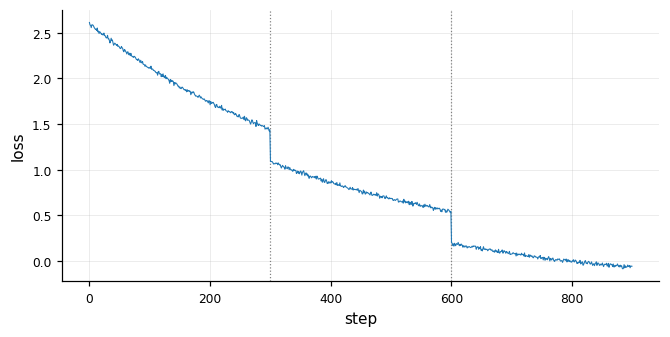
**Ask:** Loss drops in sharp steps at regular intervals (marked). Two very different explanations — name both and how to tell them apart.
**Diagnosis:** Explanation 1 (benign): a step LR schedule — each drop coincides with an LR decay, unlocking a finer minimum. Explanation 2 (alarm): drops at *epoch boundaries* on a small, repeated dataset — the model recognizes reshuffled repeats and is memorizing (common in LLM fine-tunes with few unique tokens).
**Fix / next step:** Overlay the LR schedule on the plot: if drops align with LR decays, it's the schedule. If they align with epoch boundaries and val loss is flat/worsening, it's memorization — deduplicate, reduce epochs, or get more data.
**Senior tell:** Asking 'where are the epoch boundaries and what does the LR log say?' before interpreting.

**31. Nothing happens, then everything happens** · `H`
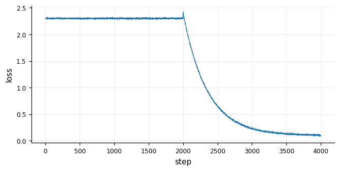
**Ask:** Loss is flat for ~2000 steps, then suddenly plunges. The junior killed an earlier identical run at step 1500 as 'broken'. Comment.
**Diagnosis:** A long plateau followed by rapid descent: causes include too-long warmup / bad initialization / normalization issues delaying signal, hard optimization landscapes (deep nets without skip connections), or grokking-style delayed generalization on algorithmic data. The flat region isn't 'no learning' — internal representations were reorganizing below the loss's resolution.
**Fix / next step:** Before killing plateaued runs: check gradient norms and parameter movement (are weights changing?), monitor a finer-grained metric (per-class accuracy, alignment probes), verify warmup length and init scale. Set kill criteria on gradient signal, not just loss flatness.

**32. VAE: sawtooth ELBO** · `H`
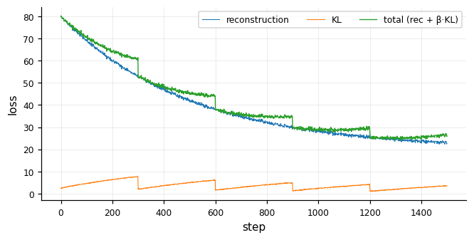
**Ask:** A VAE's reconstruction loss, KL term, and total ELBO during training with the team's annealing schedule. Early stopping keeps firing at the wrong time. Diagnose.
**Diagnosis:** Cyclical KL annealing: beta ramps 0→1 repeatedly, so the KL term (and therefore total ELBO) is a sawtooth *by construction* — each cycle restart makes ELBO 'improve' spuriously and each ramp makes it 'worsen'. Early stopping on raw ELBO fires on the schedule, not the model. Bonus read: KL collapsing toward ~0 within cycles warns of posterior collapse.
**Fix / next step:** Compare checkpoints only at equal beta (cycle ends), or early-stop on beta=1 ELBO / reconstruction quality; monitor per-dimension KL for collapse (many dims ≈ 0 ⇒ dead latents); consider free-bits. Never early-stop on a loss whose *definition* changes over time.
**Senior tell:** Spotting that the *objective itself* is nonstationary — the schedule, not the optimizer, drives the shape.

**33. Accuracy pinned at 25%** · `M`
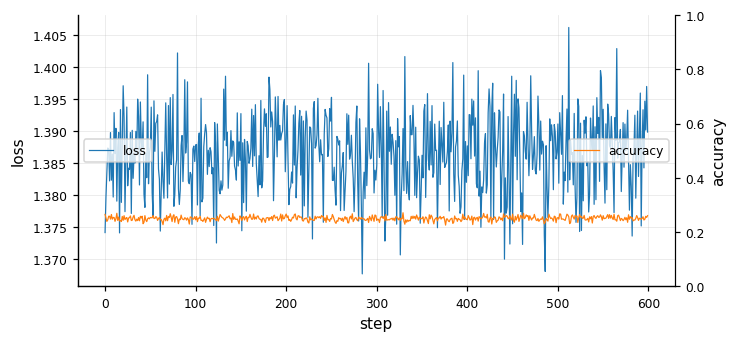
**Ask:** 4-class classifier: loss flat at ~1.386, accuracy flat at ~0.25 from step one. List the usual suspects in the order you'd check them.
**Diagnosis:** ln(4) ≈ 1.386 — the model outputs uniform probabilities (or a constant class): it has learned nothing. Suspects: (1) labels broken — mapping bug, all-one-class batches, shuffled targets; (2) LR pathologically high/low or optimizer never stepping (wrong params passed, missing optimizer.step); (3) dead network — ReLUs dead from bad init/huge LR, frozen weights; (4) input pipeline feeding constants/NaNs.
**Fix / next step:** Overfit a single batch first (should reach ~0 loss — if not, it's the code, not the data); print a batch of (x, y) and predictions; check gradient norms per layer (zeros ⇒ dead/frozen); verify label distribution in the loader.
**Senior tell:** 'Overfit one batch' as the reflex first experiment.

**34. Loss learns, metric doesn't** · `H`
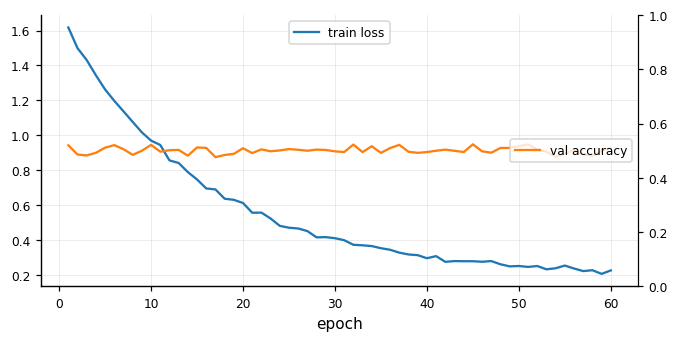
**Ask:** Train loss descends healthily; validation accuracy stays at coin-flip the entire run. What class of bugs produces this exact signature?
**Diagnosis:** The model is learning *something* — but not what the metric measures. Classic causes: (1) eval bug — argmax over the wrong axis, mismatched label encoding between train and val, metric computed on unshuffled/misaligned pairs; (2) val set corrupted (labels randomized, wrong file); (3) leakage feature present in train but absent/constant in val, so learned signal doesn't transfer; (4) loss/metric mismatch (optimizing token loss, measuring exact match).
**Fix / next step:** Evaluate the *train* metric too: if train accuracy is high while val is random, suspect split/leakage; if train accuracy is ALSO random while train loss falls, it's an eval-code bug (axis/encoding). That single extra curve bisects the bug space.
**Senior tell:** Requesting train-set accuracy as the bisecting diagnostic.

**35. GAN losses** · `H`
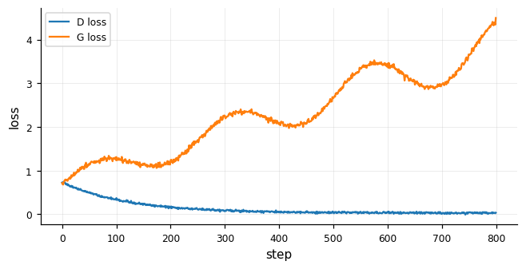
**Ask:** Discriminator and generator losses from a GAN run. The junior says 'D is winning, loss is going down, looks good.' Correct the read.
**Diagnosis:** D loss → ~0 with G loss climbing is a *failure* mode: the discriminator has overpowered the generator, gradients to G vanish (D confidently rejects everything), and training stalls — often en route to or alongside mode collapse. In adversarial training, one side's 'good' loss is not progress; equilibrium is.
**Fix / next step:** Judge by *samples* and distribution metrics (FID), not raw losses; rebalance (fewer D steps, lower D LR), use non-saturating/hinge loss, spectral norm on D, or gradient penalty. If samples are all similar: mode collapse — add minibatch discrimination/unrolled steps.
**Senior tell:** Saying explicitly: GAN loss curves are not quality curves; ask for samples/FID.

**36. Reward up and to the right** · `H`
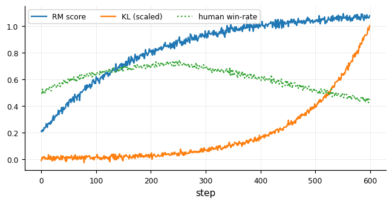
**Ask:** RLHF fine-tune: reward-model score climbs steadily; KL from the reference policy explodes; human eval win-rate (dotted) peaks then declines. The dashboard shows only the first curve. Diagnose.
**Diagnosis:** Reward hacking / over-optimization: the policy is exploiting reward-model idiosyncrasies (length, sycophancy, format tricks) rather than improving. Runaway KL means it has drifted far from the reference distribution; the declining human win-rate confirms the proxy has decoupled from the true objective (Goodhart).
**Fix / next step:** Enforce the KL penalty/constraint (tune beta), early-stop on *human/held-out* eval not RM score, use a fresh RM or RM ensembles to resist exploitation, cap response length in reward. Dashboard fix: never show proxy reward without KL and a true-eval curve beside it.

**37. Noisy twin** · `M`
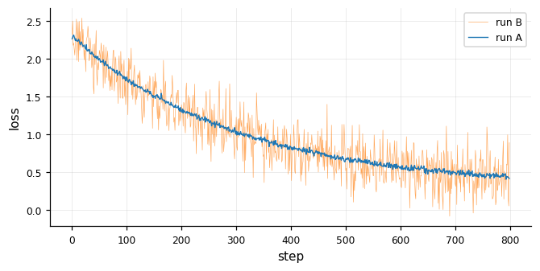
**Ask:** Two runs of the same model. The junior calls run B 'unstable' and wants to abandon the config. Verdict?
**Diagnosis:** Run B just uses a much smaller batch size (or the plot lacks smoothing): per-step loss is a noisy estimate whose variance scales inversely with batch size; the underlying trend of both runs is identical. 'Instability' here is estimator noise, not optimization failure — abandoning the config wastes a working setup.
**Fix / next step:** Compare smoothed curves (EMA) or fixed-size validation evaluations, not raw minibatch loss; if small batches are needed for memory, accumulate gradients; reserve 'unstable' for divergence or NaNs, not variance.

**38. The first 200 steps** · `M`
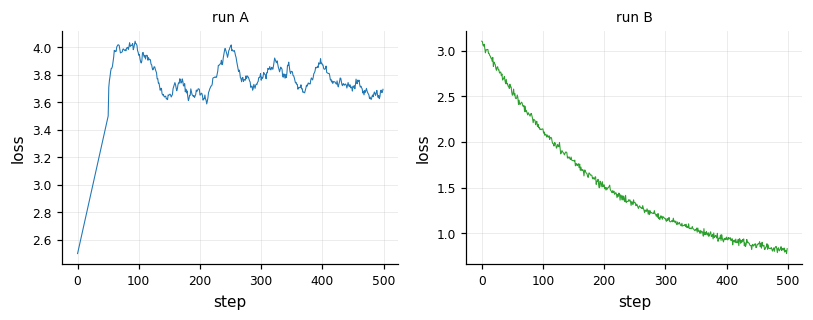
**Ask:** Two transformer fine-tunes, identical except one setting. Left diverges immediately; right is healthy. What's the missing ingredient?
**Diagnosis:** No LR warmup (and/or too-high initial LR) on the left: at initialization, Adam's second-moment estimates are unreliable and early gradients through fresh layers are large; full LR immediately produces huge destabilizing updates — loss spikes in the first tens of steps and never recovers. The right run ramps LR over the first few hundred steps.
**Fix / next step:** Linear/cosine warmup over ~1–5% of steps is near-mandatory for transformer training; pair with grad clipping; if divergence persists, lower peak LR. Diagnose by overlaying the LR schedule on the loss for the first 500 steps.

**39. Bigger got worse, then better** · `H`
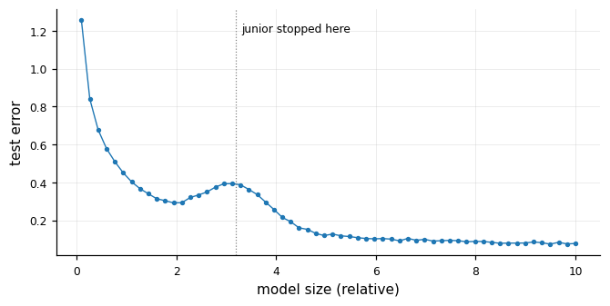
**Ask:** Test error vs model size on a fixed dataset. The junior stopped scaling at the marked point ('bigger is worse'). Interpret the whole curve.
**Diagnosis:** Double descent: test error falls, *rises* near the interpolation threshold (model just big enough to memorize the training set — the worst place to sit), then falls again in the overparameterized regime. Stopping at the peak's left shoulder abandons the second descent where the largest models generalize best.
**Fix / next step:** Recognize the regime: if near the interpolation threshold, either regularize/add data or scale *past* it; never conclude 'bigger is worse' from a single point on this curve. Also note: more data shifts the peak — the phenomenon is size-vs-data relative.

**40. The warning before the spike** · `H`
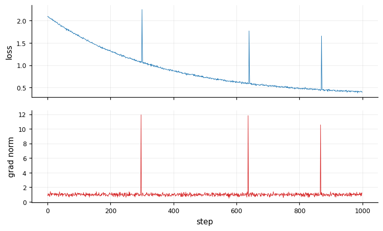
**Ask:** Loss (top) and global gradient norm (bottom) from the same run. What's the relationship, and what do you build from it?
**Diagnosis:** Gradient-norm spikes *precede* each loss spike by a few steps: exploding gradients from bad batches/instability corrupt the weights, and the damage shows in the loss shortly after. The grad norm is the leading indicator; the loss is the lagging one.
**Fix / next step:** Gradient clipping (by global norm) as the immediate guard; alert/checkpoint on grad-norm anomalies rather than waiting for loss; log the batch ids at spike time for data forensics. Monitoring the *cause* beats monitoring the symptom.

**41. Regularized into the ground** · `M`
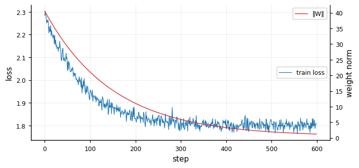
**Ask:** Training loss (blue) and total weight norm (red, right axis). The model won't fit even the training set. Where do you look?
**Diagnosis:** The weight norm is decaying toward zero while loss plateaus high: weight decay (or L2) is set so strong that shrinkage overwhelms the task gradient — the optimizer is optimizing the penalty, not the loss. The model is being regularized into a near-zero function; classic silent misconfiguration (e.g., decay meant as 1e-4 entered as 1e-1).
**Fix / next step:** Check the weight-decay value and which parameter groups it applies to (biases/norms usually excluded); sweep decay on a log grid; the weight-norm curve belongs on every training dashboard precisely for this failure.

**42. Same checkpoint, twenty answers** · `M`
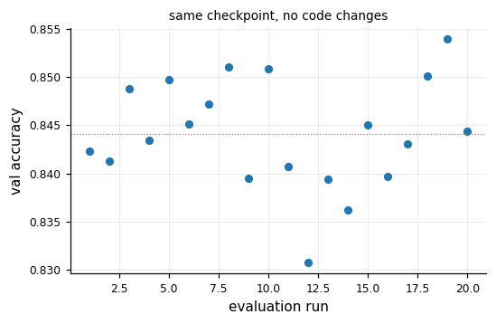
**Ask:** Validation accuracy from evaluating the *same frozen checkpoint* 20 times. Explain the spread.
**Diagnosis:** Evaluation is stochastic when it shouldn't be: dropout left active (model.train() at eval), nondeterministic augmentation applied to val data, or sampling-based decoding. A ±1.5-point spread means model comparisons smaller than that are unreadable — 'improvements' may be re-rolls of eval noise.
**Fix / next step:** model.eval() + torch.no_grad(); disable augmentation on val; fix decoding (greedy or fixed seed); re-run the 20× check until spread ≈ 0 (or quantify irreducible eval noise and require deltas to exceed it).
**Senior tell:** Running the repeated-eval experiment at all — most people never test eval determinism.

**43. The loss that breathes** · `M`
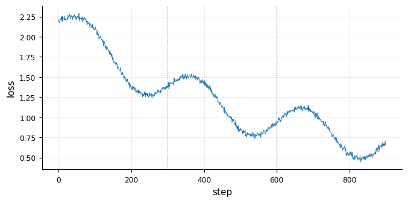
**Ask:** Per-step training loss with epoch boundaries marked. What does the within-epoch wave mean?
**Diagnosis:** The loss oscillates with a period of exactly one epoch: the data isn't shuffled and is *ordered* (by class, by customer, by date), so the model cycles through easy and hard regions in the same order every pass — and keeps partially unlearning one region while fitting another.
**Fix / next step:** Shuffle per epoch (check the DataLoader flag actually reaches the sampler); for grouped/temporal data use appropriate ordering deliberately, not accidentally; after fixing, the wave disappears and convergence typically improves.

**44. Training that quietly stopped** · `H`
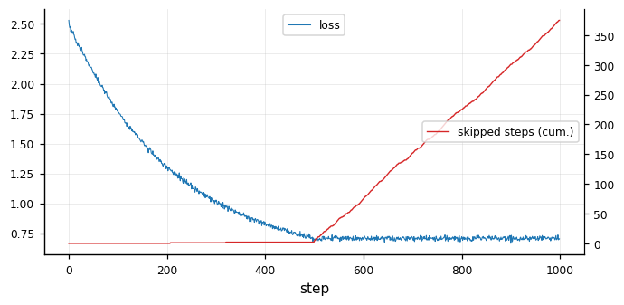
**Ask:** Mixed-precision run: loss (blue) and the cumulative count of optimizer steps *skipped* by the grad scaler (red). Loss has plateaued. Connect the curves.
**Diagnosis:** In fp16 with dynamic loss scaling, steps with inf/NaN gradients are skipped. The skip counter climbing steeply means most recent batches overflow — the effective learning rate is ~zero, so the loss 'plateau' is actually training having silently stopped, not convergence.
**Fix / next step:** Find the overflow source: attention logits/softmax in fp16, a loss term exploding, LR too high; use bf16 if available (no scaling games), keep sensitive ops in fp32, reduce LR. Alert when skip-rate exceeds a few percent — it's a first-class health metric.
**Senior tell:** Reading 'plateau + rising skips' as *stopped*, not *converged*.

**45. The validation set that got used up** · `H`
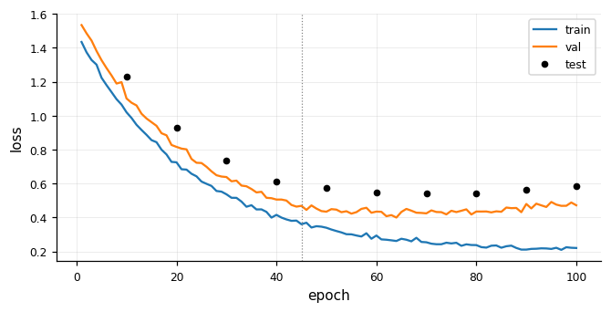
**Ask:** Train and validation loss, with the sparse *test* evaluations (black dots) added after the fact. The chosen model is at the val minimum. What's the gap?
**Diagnosis:** The test dots sit clearly above the validation curve near the selected checkpoint: the val set was consumed by dozens of decisions (early stopping, LR choice, architecture picks), so the val minimum is optimistically biased — classic adaptive overfitting to the validation set. Test reveals the honest number.
**Fix / next step:** Budget the val set: track how many decisions it has adjudicated; keep a locked test set opened rarely; for heavy experimentation, rotate/refresh validation splits or use nested CV. Report test-at-selection, not val-at-selection.

**46. Spikes on schedule** · `M`
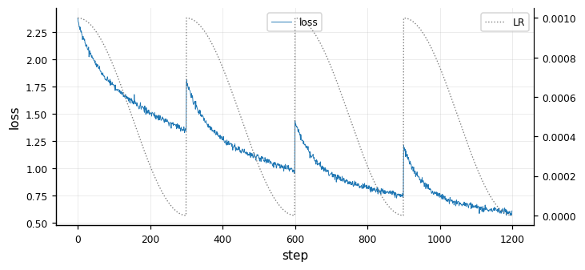
**Ask:** Loss with periodic spikes that each resolve to a *lower* minimum; LR overlaid (dotted). Bug or feature?
**Diagnosis:** Feature: cosine annealing with warm restarts — LR resets periodically, each reset briefly kicks the loss up, then the model settles into a better basin. The spikes align exactly with LR restarts and the post-spike minima improve monotonically; nothing is broken.
**Fix / next step:** Confirm alignment with the schedule (as plotted); evaluate/checkpoint at cycle *ends*, not mid-restart; if the spikes bother production consumers of the metric, report cycle-end values. Contrast with data-driven spikes: those don't align with the schedule and don't systematically improve.

**47. Twelve layers, two gradients** · `H`
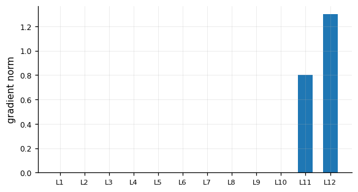
**Ask:** Per-layer gradient norms after a training step. Training 'works' but final quality is mediocre. Read the bars.
**Diagnosis:** Layers 1–10 have essentially zero gradient — the backbone is frozen (requires_grad=False left from a warmup phase, a stray .detach(), or an optimizer built over only the head's parameters). Only the head is learning; the 'training' is a linear probe wearing a fine-tune's clothes.
**Fix / next step:** Audit which parameters are in the optimizer and their requires_grad; if freezing was intentional, unfreeze on schedule (gradual unfreezing) and verify with exactly this per-layer plot; add a startup assertion counting trainable parameters against expectation.
**Senior tell:** Asking for trainable-parameter count vs total as a standard run header.

**48. 92% of tokens, 12% of answers** · `H`
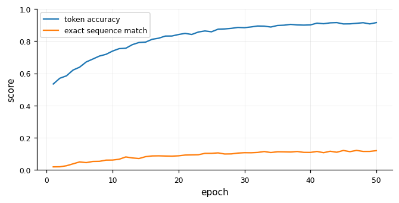
**Ask:** A seq2seq model: token-level accuracy vs exact-sequence-match over training. Why the chasm, and which number does the product feel?
**Diagnosis:** Token accuracy averages over mostly-easy positions and is computed with teacher forcing (gold history); exact match requires *every* token right under the model's own generations, where one early error cascades (exposure bias). 92% token accuracy at length 20 implies roughly 0.92²⁰ ≈ 19% sequences even if errors were independent — the product ships sequences, so 12% is the real number.
**Fix / next step:** Optimize/select on sequence-level metrics (exact match, edit distance, task success); evaluate in free-running generation mode; mitigations: scheduled sampling, beam search, constrained decoding, or sequence-level objectives.

---

## Domain C — Evaluation & Metrics Plots

**49. The perfect ROC curve** · `H`
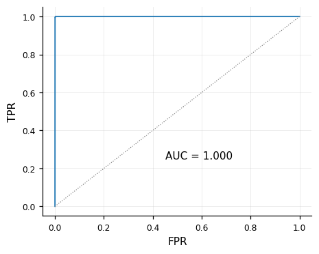
**Ask:** ROC on the holdout for a churn model, straight from the junior's notebook. React.
**Diagnosis:** AUC ≈ 0.999 on real-world churn is not 'great' — it's a leakage alarm. Something in the features encodes the label: a post-outcome field (e.g., 'account_closed_date', refund flags), duplicated rows across split, target-derived features, or a time split that lets the future in. Real behavioral problems don't separate this cleanly.
**Fix / next step:** Audit top features (importance) for anything captured *after* the label event; check duplicate rows across train/test; verify the split is temporal if deployment is; recompute after removing the suspect field. Ship only when the number drops to something believable and stable.
**Senior tell:** Treating 'too good' as a bug report, not a win.

**50. Good ROC, useless model** · `H`
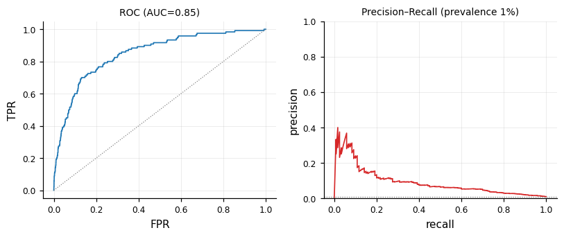
**Ask:** Same fraud model (1% prevalence), two views: ROC (left) and precision–recall (right). The team celebrates the left plot. What does the right one say?
**Diagnosis:** ROC-AUC ≈ 0.86 looks strong because FPR's denominator is the huge negative class — ROC is prevalence-blind. The PR view shows the truth at 1% prevalence: precision is under ~15% at any useful recall, i.e., at recall 0.5 roughly 9 of 10 alerts are false. Analysts will drown; the model may be unshippable at this operating point.
**Fix / next step:** Evaluate with PR-AUC / precision@k at the *actual* review capacity; pick the threshold from the cost of FP review vs missed fraud; consider reweighting or a cascaded design. Report both curves, always, for rare events.

**51. Reliability diagram** · `M`
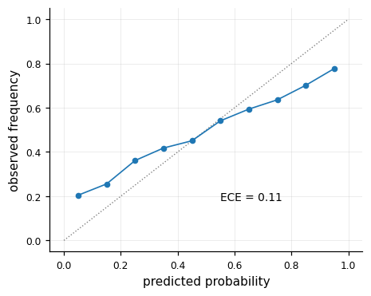
**Ask:** Calibration plot for a neural classifier (predicted probability vs observed frequency, by decile). What's wrong and when does it matter?
**Diagnosis:** Systematic overconfidence: in the top deciles the model says 0.9 but reality is ~0.72; the curve sags below the diagonal at high predictions (and sits above at low ones). Ranking (AUC) can be fine while probabilities are unusable — deadly wherever probabilities feed decisions: expected-value pricing, alert thresholds, downstream expected-cost math.
**Fix / next step:** Post-hoc calibration on a held-out set — temperature scaling (one parameter, preserves ranking) or isotonic regression if enough data; report ECE alongside AUC; recalibrate after every retrain/drift.

**52. 98% accuracy** · `M`
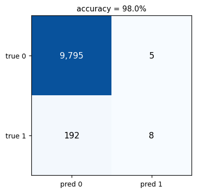
**Ask:** Confusion matrix on the test set; the junior's summary is 'accuracy 98%, ready to deploy'. Read the matrix for them.
**Diagnosis:** Of 200 actual positives the model catches 8 — recall 4% — while accuracy is propped up by 9,795 easy negatives. It is effectively the constant-majority classifier with noise. If the positive class is the one that matters (fraud, churn, defect), this model does nothing.
**Fix / next step:** Report per-class recall/precision and PR-AUC; set the threshold for a target recall and show the precision cost; if training itself collapsed to majority, fix with class weights / resampling / a proper loss — then re-read the matrix, not the accuracy.

**53. Two learning curves, two prescriptions** · `H`
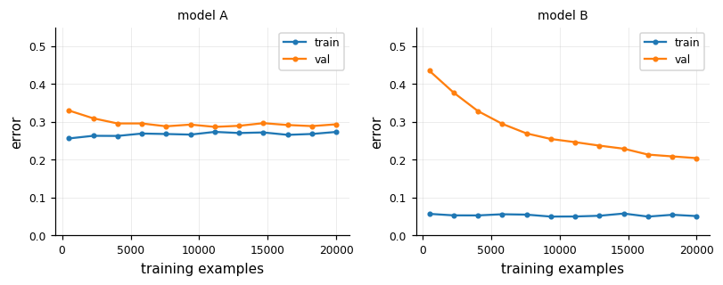
**Ask:** Error vs training-set size for two different models on the same task. Prescribe for each — and say which one 'collect more data' helps.
**Diagnosis:** Left: train and validation error converge early to the *same high plateau* — high bias/underfit; the model can't represent the signal, and more data moves nothing. Right: low train error with a large, slowly-closing gap — high variance/overfit; validation error is still improving with n.
**Fix / next step:** Left: add capacity/features, reduce regularization, engineer better inputs — data collection is wasted money. Right: more data genuinely helps; meanwhile regularize/simplify. This plot is the cheapest way to decide whether the next sprint buys data or model work.

**54. Where the F1 actually peaks** · `M`
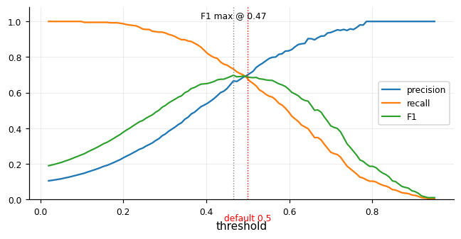
**Ask:** Precision, recall and F1 versus decision threshold for a 10%-prevalence classifier. The service uses 0.5. Comment.
**Diagnosis:** F1 peaks near threshold ≈ 0.3, far from the default 0.5. Under imbalance the score distribution is shifted; at 0.5 recall has already collapsed while precision gains little. The default threshold silently costs a large fraction of achievable F1.
**Fix / next step:** Tune the threshold on validation for the metric the business actually optimizes (F1, Fβ, or expected cost with real FP/FN prices); freeze it as a deployed artifact, and re-tune after retrains — thresholds don't transfer across models.
**Senior tell:** Noting the threshold is a *model artifact* to version, not a constant.

**55. The average hides a segment** · `M`
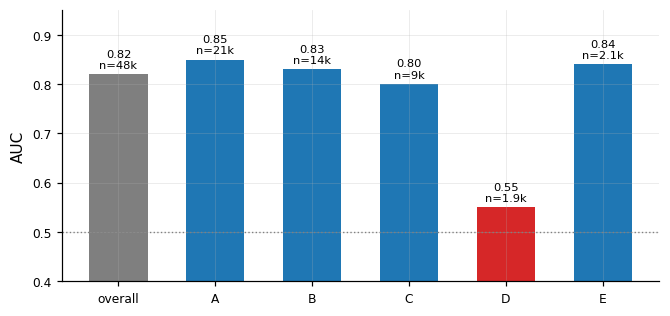
**Ask:** AUC overall and by customer segment (bar heights, n per segment annotated). Overall AUC is 0.82 and the model 'passed QA'. What did QA miss?
**Diagnosis:** Segment D sits at 0.55 — coin-flip performance — hidden inside a healthy average because D is small (n=1,900). If D is a segment that matters (a region, a protected group, a strategic account tier), the model fails exactly there while the topline looks fine.
**Fix / next step:** Make per-segment evaluation (with CIs — small segments are noisy) a release gate; investigate D: feature coverage, label quality, distribution mismatch; consider a segment feature, reweighting, or a dedicated model. Averages are where failures hide.

**56. Offline up, online flat** · `H`
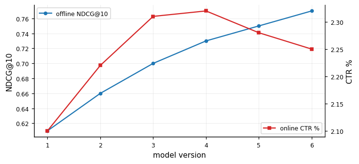
**Ask:** Recommender iterations v1→v6: offline NDCG@10 (left axis) vs online CTR from A/B tests (right axis). Explain the divergence.
**Diagnosis:** Offline gains stopped translating after v3: the offline eval is computed on *logged* interactions generated by earlier models — it rewards re-ranking what the old policy already showed (position/exposure bias, feedback loop). The offline metric is optimizing agreement with history, not incremental value; online CTR is flat and even dips as the model overfits logs.
**Fix / next step:** Treat logged-data offline eval as biased: use counterfactual estimators (IPS/DR) or interleaving; keep a randomized exploration slice to collect unbiased feedback; gate releases on online experiments, and track offline–online correlation as a first-class metric.
**Senior tell:** Naming the feedback loop: the training/eval data was created by the previous policy.

**57. One threshold, two populations** · `H`
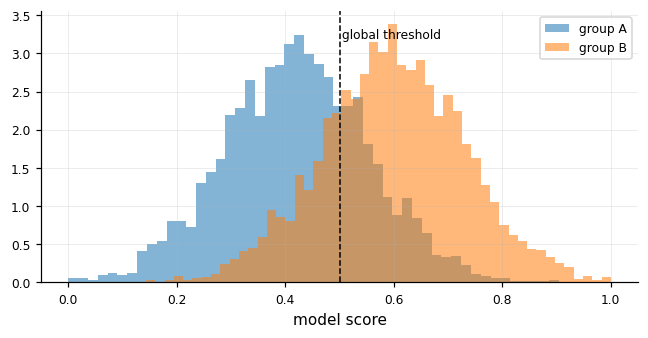
**Ask:** Score distributions for two customer groups, with the single global decision threshold (dashed). What happens at deployment?
**Diagnosis:** The groups' score distributions are shifted relative to each other; a single global threshold yields very different approval/alert rates and different FPR/FNR per group. If groups differ in base rate or the model is miscalibrated per group, this is both a performance and a fairness problem — one group absorbs most of the errors.
**Fix / next step:** Check calibration *within each group*; decide the fairness criterion explicitly (equalized odds vs demographic parity vs calibrated thresholds — they conflict); consider group-wise thresholds or recalibration where legally/ethically appropriate; monitor per-group error rates in production.

**58. Gains chart at the wrong depth** · `M`
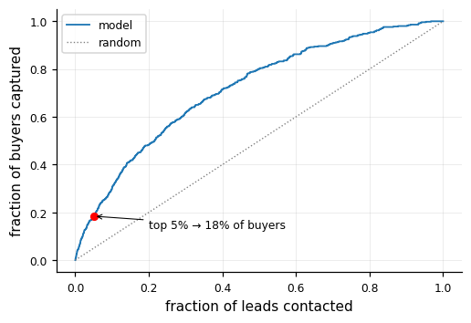
**Ask:** Cumulative gains for a lead-scoring model (AUC 0.75). Sales can call the top 5% of leads only. Is the model useful?
**Diagnosis:** The curve looks impressive at mid-depth ('top 40% captures ~75% of buyers'), but at the actual operating depth — 5% — it captures only ~11% of positives, barely above the 5% a random pick gets. Global AUC and mid-curve gains say nothing about the extreme-top ranking quality that this use case lives on.
**Fix / next step:** Evaluate at the operating point: lift@5%, precision@k for the real k; if the top decile is weak, optimize for it (ranking losses that weight the head, calibrate the extreme scores, add features separating the very best leads). Metric depth must match action capacity.

**59. The model that improved overnight** · `H`
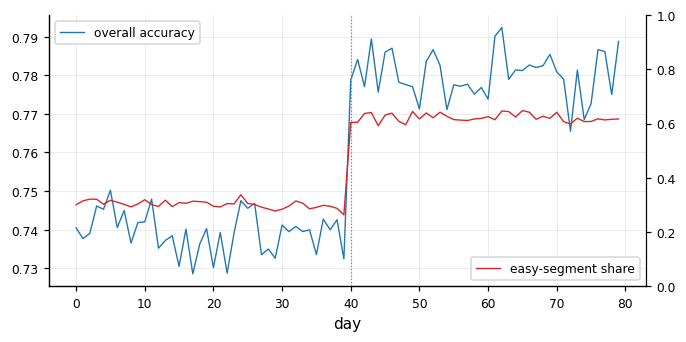
**Ask:** Daily model accuracy (blue) and the share of traffic from the 'easy' segment (red). Accuracy jumped 4 points on day 40 with no deploy. Explain.
**Diagnosis:** Population mix shift: on day 40 an upstream change (marketing campaign, a filter, a partner integration) doubled the share of easy-segment traffic; per-segment accuracy is unchanged, but the blended average rose. The 'improvement' is composition, not capability — and it can reverse just as silently.
**Fix / next step:** Always decompose topline metrics by segment with mix weights (a one-line Oaxaca-style decomposition: Δmetric = Σ share·Δperf + Σ Δshare·perf); alert on mix shifts alongside metric shifts; never credit or blame a model for a move that decomposition assigns to mix.

**60. Two ROC curves, one choice** · `M`
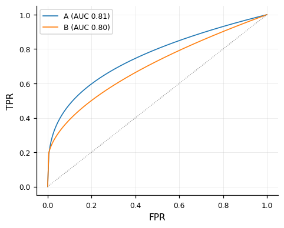
**Ask:** Model A and Model B on the same test set; AUCs are 0.81 vs 0.80. Procurement wants 'the better model'. Answer properly.
**Diagnosis:** The curves *cross*: A dominates at low FPR (the strict-threshold regime), B dominates at high TPR. Near-equal AUC hides that they're better at different operating points — 'better' is undefined until the operating constraint (max FPR budget, or required recall) is stated.
**Fix / next step:** Choose by the deployment constraint: compare partial AUC or TPR at the mandated FPR (or cost-weighted expected loss); if the operating point may move, prefer the model better in the plausible region. Report the operating point with the choice.

**61. 0.842 beats 0.830?** · `M`
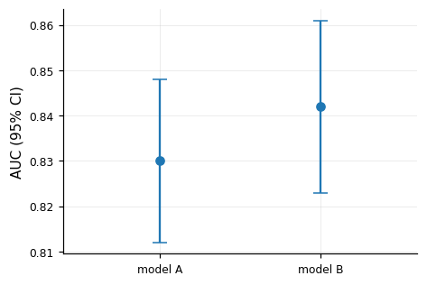
**Ask:** Two models' AUC with bootstrap 95% CIs on a 1,800-row test set. The junior is about to declare B the winner and swap production. Assess.
**Diagnosis:** The CIs overlap almost entirely: a +0.012 AUC difference on n=1,800 is well within resampling noise — the 'win' is not established. Swapping production models has real costs (risk, re-calibration, monitoring reset) and this evidence doesn't clear the bar.
**Fix / next step:** Test the *paired* difference (bootstrap the delta on the same resamples — much tighter than comparing marginal CIs), enlarge the test set, or run online. Institute a rule: model swaps require a significant paired improvement, not a higher point estimate.
**Senior tell:** Knowing the paired-delta bootstrap is the right test, not two marginal CIs.

**62. The macro/micro chasm** · `M`
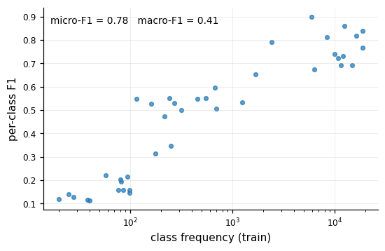
**Ask:** Per-class F1 vs class frequency (log x) for a 40-class product classifier; micro-F1 = 0.78, macro-F1 = 0.41. What's the story and which number should the business see?
**Diagnosis:** Performance collapses on the long tail: frequent classes score 0.8+, rare classes near zero. Micro-F1 (weighted by instances) hides them; macro exposes them. If tail classes carry business weight (new products, niche categories), 0.41 is the honest headline.
**Fix / next step:** Report both plus this scatter; improve the tail: class-balanced loss/resampling, few-shot augmentation, hierarchical fallback to parent categories, or explicit 'route rare to human'. Also set per-class minimum-support requirements before trusting per-class scores.

**63. Accuracy has a shelf life** · `M`
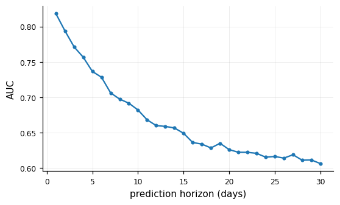
**Ask:** AUC as a function of how far ahead the prediction is made (days between scoring and outcome). The product page quotes 'AUC 0.84'. Contextualize.
**Diagnosis:** The 0.84 is the 1-day-ahead figure; skill decays with horizon to ~0.62 at 30 days as the world injects noise between prediction and outcome. If the business acts on 2–4-week-ahead scores, the effective quality is the right side of this curve, not the headline.
**Fix / next step:** Report metric-by-horizon; train/calibrate separate models per horizon if decisions span several; set expectations (and thresholds) at the horizon actually used. A single-number metric for a multi-horizon product is an ambiguity bug.

**64. Optimizing the proxy** · `H`
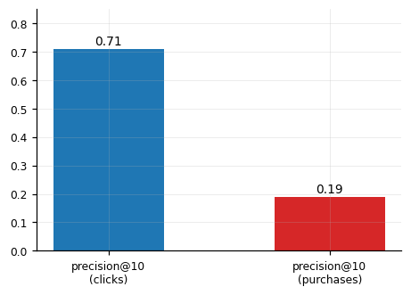
**Ask:** The ranking model was trained and evaluated on *clicks*. Precision@10 on clicks vs on *purchases* for the same recommendations. Interpret.
**Diagnosis:** The model is excellent at predicting its proxy (clicks, 0.71) and poor at the true objective (purchase, 0.19): click-optimization surfaces clickbait-adjacent items — attractive thumbnails, low commitment — that don't convert. Goodhart at the metric level: the proxy diverged from the target.
**Fix / next step:** Move the label toward value: train on conversions or click→purchase weighted composites (handling delay/sparsity), add post-click quality signals, and gate releases on downstream-value metrics; keep the proxy only as an auxiliary task, never the objective.

**65. Alert volume doubled, model unchanged** · `M`
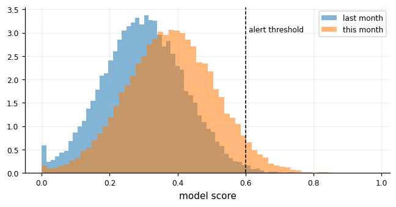
**Ask:** Model score distribution last month vs this month, with the fixed alert threshold. Ops reports 2.1× alert volume and blames the model team. Diagnose.
**Diagnosis:** Score drift: the distribution shifted right (input drift, seasonal case mix, or an upstream feature change), so a *fixed* threshold now captures far more mass. The model may rank exactly as well as before — the operating point silently moved because thresholds are absolute while distributions aren't.
**Fix / next step:** Investigate the input drift first (real risk increase vs pipeline artifact); if ranking is intact, either recalibrate scores or set thresholds by quantile/capacity rather than absolute value; monitor score-distribution stats (PSI on the score) with alerts tied to threshold-crossing mass.

**66. Every segment worse, total better** · `H`
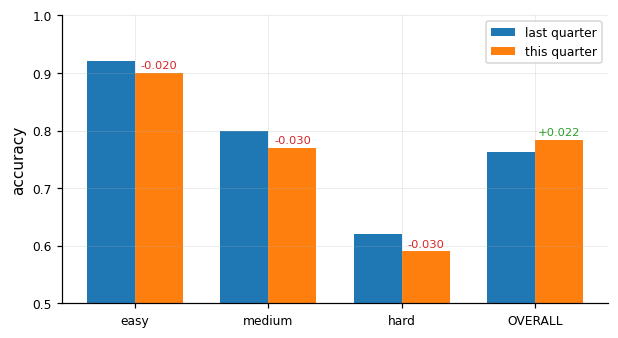
**Ask:** Accuracy by segment, last quarter vs this quarter — plus the overall bar. Read carefully and explain to a skeptical VP.
**Diagnosis:** Simpson's paradox in a KPI: each segment's accuracy *declined*, yet overall accuracy rose because traffic mix shifted toward the easy segment (whose share grew). The aggregate improvement is a composition artifact concealing across-the-board degradation.
**Fix / next step:** Decompose the change into performance and mix components and report both; fix the actual regressions per segment; set dashboards to show segment metrics with mix-shift annotations so aggregates can't quietly launder decline.
**Senior tell:** Volunteering the mix/performance decomposition rather than re-arguing the numbers.

---

## Domain D — Regression Diagnostics

**67. Funnel residuals** · `M`
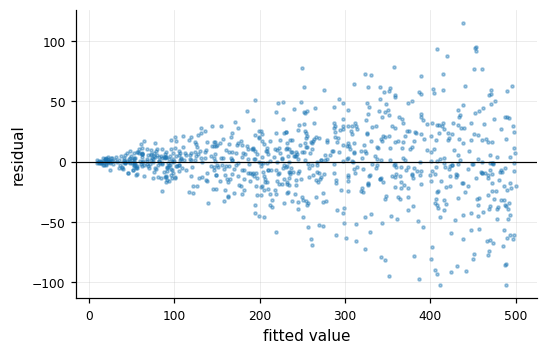
**Ask:** Residuals vs fitted values for a revenue model trained with MSE. Diagnose and prescribe.
**Diagnosis:** Heteroscedasticity: error variance grows with the predicted level (funnel). MSE then over-weights large accounts, standard errors and any prediction intervals computed under constant variance are wrong, and small-account predictions are systematically noisy relative to reported confidence.
**Fix / next step:** Model in log space or use a variance-linked GLM (gamma/Tweedie); or quantile regression if intervals are the product; weighted least squares if variance structure is known. Re-check the plot after — it's the test of the fix.

**68. Curved residuals** · `M`
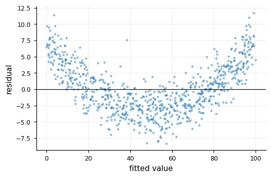
**Ask:** Residuals vs fitted for a linear model. What does the shape say?
**Diagnosis:** A clear U: the model is systematically under-predicting at both extremes and over-predicting mid-range — a missing nonlinearity (quadratic term, interaction, or wrong link/target transform). The 'random cloud around zero' assumption is visibly violated; coefficients and R² are being reported for a misspecified mean function.
**Fix / next step:** Add the nonlinear term / splines / a GBM benchmark to bound the gap; or transform the target; partial-residual plots per feature localize which variable carries the curvature.

**69. Predicted vs actual: the flat band** · `H`
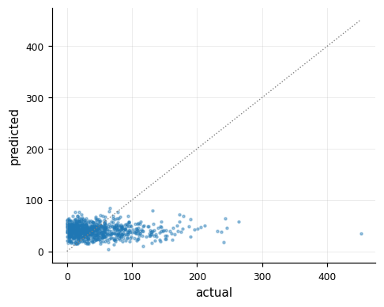
**Ask:** Predicted vs actual for a demand model (45° line shown). Two pathologies are visible — name both.
**Diagnosis:** (1) Mean collapse: predictions live in a narrow horizontal band around the global mean regardless of actuals — the MSE-on-skewed-target failure; the model explains almost none of the variance yet can report a decent-looking RMSE. (2) A hard floor: predictions clipped at zero exactly (post-hoc clip of negative outputs), a symptom of a likelihood that permits negatives for a nonnegative target.
**Fix / next step:** Fix the likelihood (Tweedie/NB/hurdle or log-link GLM) rather than clipping; add the features that actually separate high from low demand; track R²/variance-explained alongside RMSE so a flat predictor can't hide.

**70. QQ plot with flared tails** · `M`
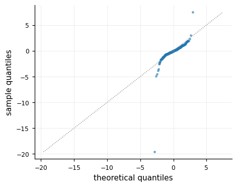
**Ask:** Normal QQ plot of model residuals. Interpretation, and what breaks if you ignore it?
**Diagnosis:** Both ends flare away from the line: residuals are heavy-tailed relative to Gaussian. MSE (Gaussian MLE) lets rare huge errors dominate the fit; parametric intervals are too narrow; a few extreme rows can steer coefficients.
**Fix / next step:** Robust losses (Huber/quantile), model the tails (t-distribution likelihood), winsorize only with business justification, or investigate: heavy tails are often unmodeled segments/events, not noise. Validate intervals empirically (coverage), not from normal theory.

**71. The forecast that always comes up short** · `H`
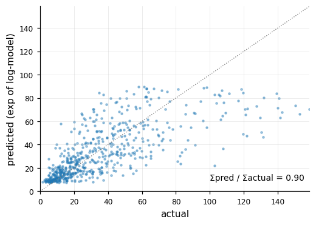
**Ask:** The model is trained on log(y) and residuals in log space are perfectly centered. Back in real units (plot), predictions systematically undershoot — totals miss by ~18%. Explain.
**Diagnosis:** Retransformation bias: E[exp(ε)] > exp(E[ε]) (Jensen). Exponentiating a log-space conditional *mean* yields the conditional *median*-ish level, biased low for the mean of a right-skewed target; the bias compounds when summing to totals — exactly the reported −18%.
**Fix / next step:** Apply a smearing correction (Duan) or add σ²/2 under lognormal errors; or skip the transform and use a log-link GLM (gamma/Tweedie), which models E[y] directly. Validate on *totals* in original units, not just per-row log-space metrics.
**Senior tell:** Citing Jensen's inequality (or 'mean vs median in log space') unprompted.

**72. Residual ACF** · `M`
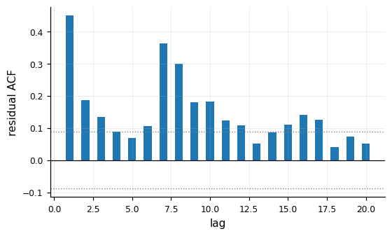
**Ask:** Autocorrelation of residuals from a daily forecasting model (95% band shown). What does it mean that bars poke out?
**Diagnosis:** Significant autocorrelation at lag 1 and a spike at lag 7: the residuals still contain structure — short-term momentum and a weekly cycle the model didn't absorb. Errors are not exchangeable; intervals are wrong; and there is free accuracy on the table.
**Fix / next step:** Add lag features / day-of-week seasonality (or SARIMA error terms); re-run the residual ACF as the acceptance test — a correct model leaves white noise. Also fix any CV that assumed i.i.d. residuals.

**73. Negative demand** · `M`
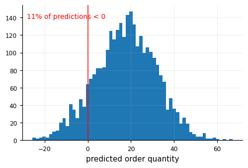
**Ask:** Histogram of a regression model's predictions for order quantity. Spot the problem before anyone reads a metric.
**Diagnosis:** A visible mass of predictions below zero for a physically nonnegative target: the Gaussian/MSE model's support doesn't match the data. Downstream systems either clip (introducing bias, see the flat-band pathology) or crash; either way the likelihood is wrong.
**Fix / next step:** Use a support-respecting model: log-link GLM, Tweedie/negative binomial for counts, or a hurdle model if zeros are structural. If a quick patch is unavoidable, clip *and* log the clip rate as a health metric — a rising clip rate is drift.

**74. Striped scatter** · `M`
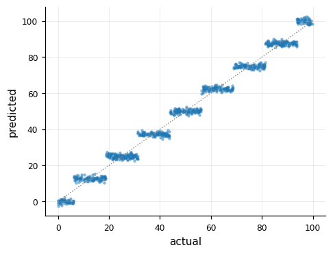
**Ask:** Predicted vs actual. The horizontal banding is not a rendering artifact. What is it, and does it matter?
**Diagnosis:** Predictions are quantized to a coarse grid: the 'regressor' is actually emitting a small set of discrete values — a tree with few leaves, a rounded/bucketed upstream feature dominating, or the target itself was binned during ETL and the model learned the bins. Fine-grained ranking within a stripe is impossible; percentile-based decisions get chunky.
**Fix / next step:** Trace provenance: is it the model (leaf count — deepen/blend), a feature (rounded upstream — fix ETL), or the label (binned at source — get raw values)? The stripe *count* usually identifies the culprit immediately.
**Senior tell:** Asking whether the *labels* were quantized before blaming the model.

**75. Residuals vs a feature** · `M`
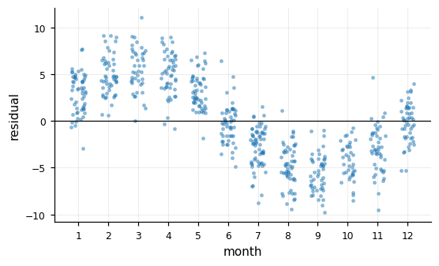
**Ask:** Residuals plotted against one input feature (month). The residual-vs-fitted plot looked clean. What did it hide?
**Diagnosis:** A clear sinusoidal pattern vs *month*: the model misses a seasonal effect in this feature even though aggregate residuals-vs-fitted looked centered (patterns can cancel when projected onto fitted values). Errors are systematic conditional on month — the model over-predicts some seasons and under-predicts others every year.
**Fix / next step:** Add month effects (cyclic encoding, dummies, or splines); make residual-vs-each-feature panels a standard diagnostic, not just residual-vs-fitted; partial dependence + residual overlays localize which features still carry signal.

**76. One point, two regression lines** · `M`
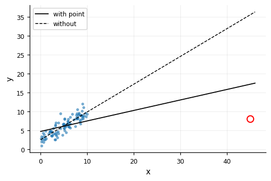
**Ask:** The same data fit with (solid) and without (dashed) the circled point. What phenomenon is this, and what's the policy?
**Diagnosis:** High leverage: the circled point sits far outside the x-range and single-handedly rotates the fit — the solid line answers to one observation more than to the other 99. Whether it's an error or a genuine extreme, letting one row set the slope is a fragility, and standard errors don't advertise it.
**Fix / next step:** Compute influence diagnostics (Cook's distance, leverage) routinely; investigate the point's provenance; report fits with/without (as here) when influence is high; consider robust regression (Huber/RANSAC) when extreme x-values are expected in production.

**77. Coefficients that can't decide** · `H`
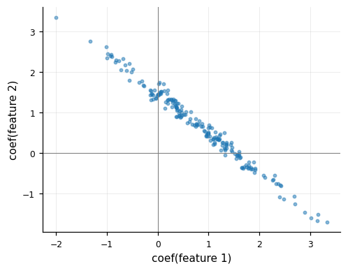
**Ask:** Estimated coefficients for two features across 200 bootstrap refits of the same linear model. Interpret the cloud.
**Diagnosis:** Severe multicollinearity: the two features are near-duplicates, so the model can shift weight freely between them — individual coefficients swing wildly and anti-correlate (their *sum* is stable), signs flip across resamples. Any story told about 'the effect of feature 1' from a single fit is noise.
**Fix / next step:** Diagnose with VIF/condition number; remedy by dropping/combining the pair, or ridge (stabilizes the estimate by shrinking along the degenerate direction); interpret grouped effects, not individual coefficients, when collinearity is structural.
**Senior tell:** Noting the anti-correlated cloud means the *sum* is identified even though each coefficient isn't.

**78. Fine inside, lost outside** · `H`
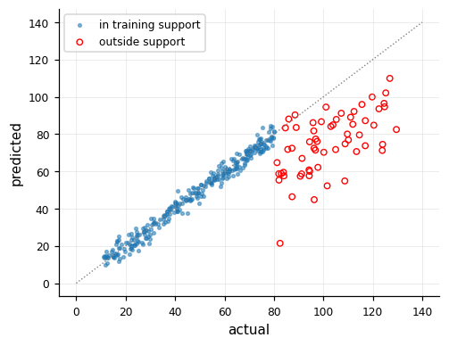
**Ask:** Predicted vs actual, colored by whether the row lies inside the training data's feature support (blue) or outside it (red hollow). Production error reports are 3× validation. Reconcile.
**Diagnosis:** Inside the training envelope the model is tight on the diagonal; outside it (new price ranges, new customer sizes, post-COVID behavior) predictions scatter badly. Validation sampled the same support as training, so it never measured extrapolation — production does, hence the 3×.
**Fix / next step:** Ship an in-support detector (density/isolation forest on features, or conformal nonconformity) and route out-of-support rows to fallbacks with wider uncertainty; monitor the out-of-support rate as drift; augment training data where the red cloud lives.
**Senior tell:** Proposing to *measure* support membership in production, not just retrain.

**79. Residuals too good to be true** · `H`
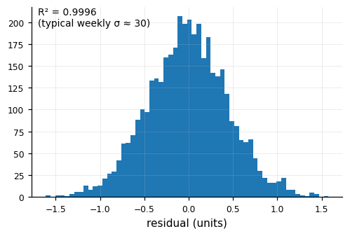
**Ask:** Residual distribution of a model predicting weekly per-store sales (typical store σ ≈ 30 units). Reported R² = 0.9996. Reaction?
**Diagnosis:** Residuals of ±0.5 units on a human/logistics process with natural weekly noise of ~30 units is not skill — it's leakage: a feature that *is* the target (revenue ÷ price), a post-outcome field, or train/test duplication. Real-world processes have irreducible noise; a model can't beat the noise floor honestly.
**Fix / next step:** Hunt the leak: feature importance (one feature will dominate), compute each top feature's availability timestamp vs prediction time, retrain without suspects; institutionalize a 'too good' tripwire — any metric above a domain-plausible ceiling requires a leakage audit before celebration.
**Senior tell:** Citing the concept of an irreducible noise floor for the process.

**80. Spiky histogram** · `M`
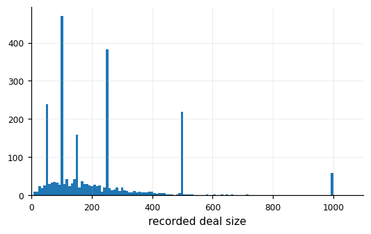
**Ask:** Distribution of the target variable (deal size) as recorded in the CRM. What is the pattern, and how does it affect modeling and evaluation?
**Diagnosis:** Heaping: mass spikes at round numbers (50, 100, 250, 500…) — humans enter rounded values, so the recorded target is a coarsened version of reality. Models get penalized for predicting between spikes; error metrics partly measure the rounding process; and small real effects can hide inside a rounding bucket.
**Fix / next step:** Acknowledge the measurement model: evaluate with tolerance bands or bucket-level metrics; consider modeling the latent continuous value with an interval likelihood; upstream, capture the true value where possible (integrations vs manual entry).

---

## Domain E — NLP / Embeddings / RAG / LLM

**81. The embedding blob** · `H`
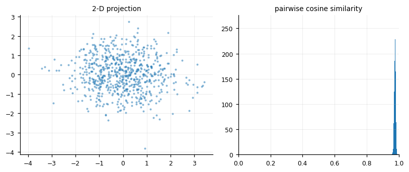
**Ask:** 2-D projection of your document embeddings (left) and the distribution of pairwise cosine similarities (right). Retrieval quality is poor. Connect the plots to the symptom.
**Diagnosis:** No cluster structure in the projection, and cosine similarities packed into a narrow high band (~0.88–0.96): the embedding space is anisotropic/collapsed — every document looks like every other, so nearest-neighbor ranking is dominated by noise. Common with untuned encoders on a narrow domain, wrong pooling (e.g., raw CLS), or embedding near-identical boilerplate.
**Fix / next step:** Check pooling (mean-pool usually beats raw CLS), normalize, and evaluate a domain-tuned or stronger multilingual encoder; fine-tune with contrastive pairs (InfoNCE) on in-domain data; strip boilerplate before embedding. Re-plot: healthy spaces show structure and a wide, discriminative similarity distribution.

**82. Positives and negatives, same similarity** · `H`
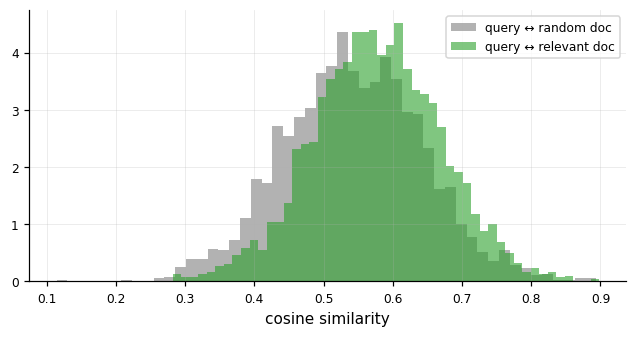
**Ask:** For labeled eval pairs: similarity of query→relevant-doc (green) vs query→random-doc (gray). What does the overlap tell you, and what's the first hypothesis to test?
**Diagnosis:** The two distributions nearly coincide — the embedding gives relevant documents essentially no similarity advantage, so retrieval is close to random regardless of k or index. First hypothesis: a space mismatch — query and documents embedded by different models/versions, or one side missed the required instruction prefix (asymmetric retrieval models), or wrong normalization/preprocessing on one side.
**Fix / next step:** Verify both sides use the identical model, version, prefix and normalization; if confirmed identical, the model genuinely can't separate this domain → fine-tune with in-domain (query, positive, negative) triplets or switch encoders. Fix and re-plot; separation of these histograms *is* the retrieval health metric.
**Senior tell:** Suspecting the two-model/prefix mismatch before blaming the encoder's quality.

**83. Clusters, but the wrong kind** · `H`
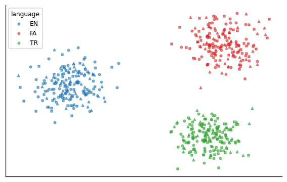
**Ask:** Projection of a trilingual corpus (color = language: EN/FA/TR; marker = topic). Retrieval works within English but cross-language queries fail. Read the map.
**Diagnosis:** The space is organized by *language*, not meaning: three language islands, with topics fully mixed inside each. A Persian query about 'payment terms' lands in the FA island and can never reach the relevant EN/TR documents — cross-lingual retrieval is structurally impossible in this space.
**Fix / next step:** Use a cross-lingually *aligned* embedding model (trained so translations map together, e.g. multilingual retrieval models); verify with a bitext sanity check (translated pairs should have top-tier similarity); interim mitigations: per-language indexes + query translation. Re-project: healthy spaces cluster by topic with languages interleaved.

**84. Retrieval scores by rank** · `M`
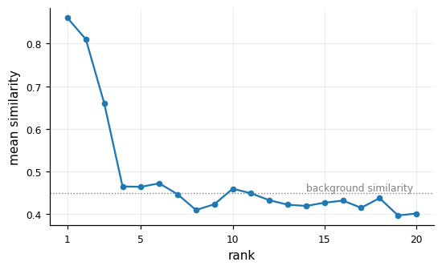
**Ask:** Mean retrieval similarity by rank position for your RAG system, which always stuffs top-k=20 into the prompt. Critique the k.
**Diagnosis:** The score curve cliffs after rank ~2–3 and flattens into an undifferentiated tail: ranks 4–20 are barely above background similarity — mostly noise. Fixed k=20 pads the context with irrelevant chunks, which measurably *hurts* generation (distraction, lost-in-middle) and burns tokens/latency.
**Fix / next step:** Use adaptive cutoffs: similarity threshold or largest score *gap*; add a reranker and cut on its calibrated score; evaluate answer quality vs k — the curve typically peaks at small k. Log per-query retained-k to catch drift.

**85. The spike at 512** · `M`
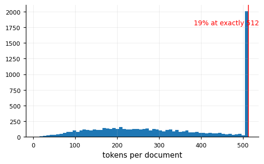
**Ask:** Distribution of tokenized document lengths entering your embedding/classification pipeline (max_length = 512). What is the spike, and why is it silent?
**Diagnosis:** The pile-up exactly at 512 is truncation: a large share of documents exceed the limit and are cut mid-content with no error raised — `truncation=True` is silent by design. Everything past the cut is invisible to the model: retrieval misses content in tails, classifications are made on introductions only.
**Fix / next step:** Measure truncation rate (this histogram *is* the alert); chunk long documents (token-aware, with overlap) instead of truncating, or use a longer-context model; log truncation per document class — legal/contract docs usually suffer most.
**Senior tell:** Calling the histogram itself a monitoring artifact to keep in the pipeline.

**86. Three languages, three token bills** · `M`
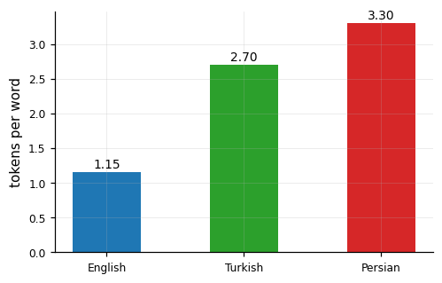
**Ask:** Tokens-per-word (fertility) for the same tokenizer across your three languages. Consequences for cost, context and quality?
**Diagnosis:** The tokenizer fragments Persian (~3.3 tokens/word) and Turkish (~2.7) far more than English (~1.15): the vocab was trained Latin-heavy. Consequences: FA/TR pay ~2–3× the token bill and burn context windows ~2–3× faster; long-doc truncation hits them first; and heavy fragmentation correlates with weaker representation quality for those languages.
**Fix / next step:** Prefer a tokenizer/model with strong multilingual vocab coverage (check fertility before adopting any model); budget context per-language; for classification, per-language max-length limits; track fertility as part of model-selection due diligence for multilingual products.

**87. Fine-tune wins, model loses** · `H`
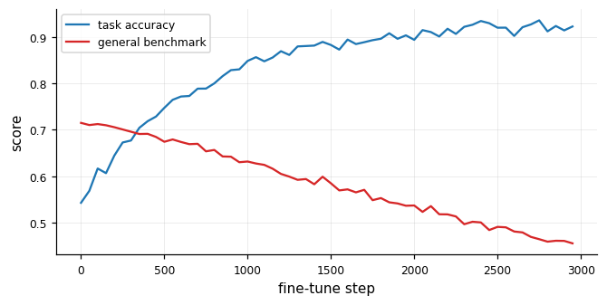
**Ask:** During a domain fine-tune: task accuracy (left axis) vs a general-capability benchmark (right axis). When do you stop, and what went wrong?
**Diagnosis:** Catastrophic forgetting: task accuracy climbs, but general capability decays steadily — past ~step 1500 the model is trading broad competence for narrow gains, and by the end it's a brittle specialist that fails on instructions, formats, or anything adjacent to but outside the task distribution.
**Fix / next step:** Stop where the *combined* objective peaks, not task-only; mitigate: mix replay/general data into fine-tuning, lower LR, fewer epochs, or parameter-efficient tuning (LoRA) which typically forgets less; always run a general-eval suite alongside task eval — one curve without the other is unreadable.

**88. Lost in the middle** · `H`
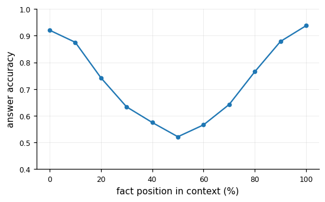
**Ask:** Needle-in-a-haystack eval: answer accuracy vs the *position* of the relevant fact inside a long context. Implications for your RAG assembly?
**Diagnosis:** The U-shape: the model reliably uses information at the very start and end of the context but degrades sharply for content buried in the middle — a robust long-context failure mode ('lost in the middle'). Naively concatenating retrieved chunks in rank order puts your best chunk first but drowns mid-ranked evidence.
**Fix / next step:** Order-aware assembly: place the highest-value chunks at the edges (start and end); keep contexts short (see the k-cutoff plot); consider map-reduce over chunks for multi-evidence questions; and run this position sweep per model — the curve's depth is model-specific.

**89. The judge that likes everything** · `H`
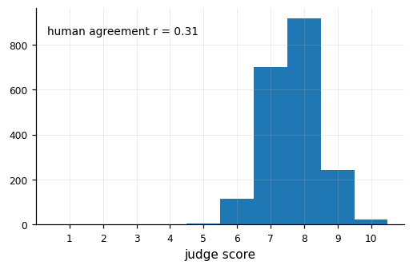
**Ask:** Score distribution from your LLM-as-judge eval (1–10) over 2,000 outputs; agreement with human raters r = 0.31. Can you trust the eval?
**Diagnosis:** No: the judge saturates — scores pile at 7–8 with tiny variance, so it can't discriminate good from mediocre, and the weak human correlation confirms it. Known judge biases at work: positivity/leniency, verbosity preference, self-model favoritism, and scale misuse (never uses 1–4).
**Fix / next step:** Switch from absolute scores to *pairwise comparisons* (A vs B), which are far more reliable; anchor with a detailed rubric and few-shot calibration examples; randomize position (position bias); keep a human-labeled calibration set and report judge–human agreement as a first-class metric; use a stronger/different judge than the generator.

**90. Epoch cliffs in an LLM fine-tune** · `H`
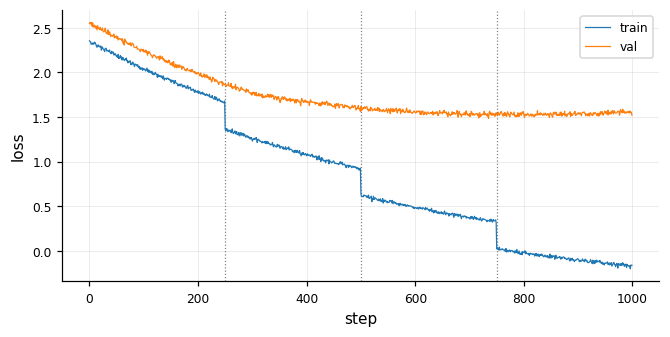
**Ask:** Train and validation loss across a 4-epoch fine-tune on a small corpus (epoch boundaries marked). Verdict?
**Diagnosis:** Sharp train-loss cliffs at each epoch boundary with validation flat-then-rising: the model is *recognizing repeated data* — memorization, not learning. Each pass over the same small corpus drops train loss discontinuously while generalization stops improving after epoch ~1 and then degrades.
**Fix / next step:** Deduplicate the corpus; 1–2 epochs max for small fine-tuning sets (or early-stop on val); get more unique data before more epochs; consider LoRA + lower LR. This differs from the LR-schedule staircase precisely because the val curve diverges — always plot both.
**Senior tell:** Using the val curve to rule out the benign LR-schedule explanation for the same shape.

**91. Chunk size sweep** · `M`
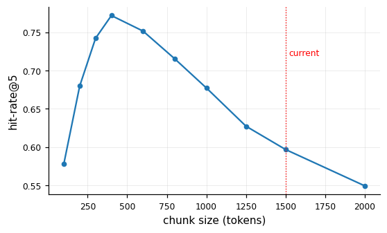
**Ask:** Retrieval hit-rate@5 as a function of chunk size for your RAG corpus. The team picked 1,500 tokens 'to keep context rich'. Advise.
**Diagnosis:** The curve is an inverted U peaking near ~400 tokens: too-small chunks lose the context needed to match queries; too-large chunks dilute the signal (many topics per vector → blurry embeddings) and waste prompt budget. 1,500 sits well past the peak, costing ~12 points of hit-rate.
**Fix / next step:** Choose chunking empirically per corpus with exactly this sweep (plus overlap and boundary strategy as separate axes); consider hierarchical or semantic chunking; re-run the sweep when the corpus or embedder changes — the optimum is not portable.

**92. Ten results, one document** · `M`
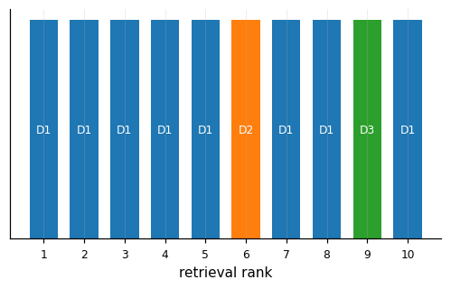
**Ask:** Source documents of the top-10 retrieved chunks for a typical query (colors = distinct documents). Users complain answers feel 'thin'. Connect.
**Diagnosis:** Eight of ten slots are chunks of the *same* document — near-duplicate boilerplate crowding out diversity. The context window carries one perspective repeated, so the LLM synthesizes from a single source; recall of the actual answer (often in doc #2 or #3) is crowded out.
**Fix / next step:** Deduplicate near-identical chunks (hash/similarity), apply MMR or per-document caps at retrieval, and diversify before the reranker; measure 'unique-source count in context' as a retrieval health metric.

**93. When retrieval is weak, the model gets creative** · `H`
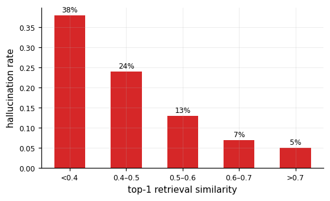
**Ask:** Hallucination rate of the RAG system bucketed by the top-1 retrieval similarity of each query. Design a policy from this plot.
**Diagnosis:** Hallucination is strongly conditional on retrieval quality: 38% when top-1 similarity < 0.4 (the model answers from thin air when context is irrelevant) vs 6% above 0.6. The aggregate hallucination rate hides that the system is trustworthy exactly when retrieval works and dangerous when it doesn't.
**Fix / next step:** Gate on retrieval confidence: below a threshold, abstain / say 'not in the knowledge base' / route to search or human; log the abstain rate; tune the threshold on this curve against the business's error tolerance. Retrieval score is your cheapest hallucination predictor.
**Senior tell:** Turning the plot directly into an abstention policy with a measured operating point.

**94. More context, flat quality, rising bill** · `M`
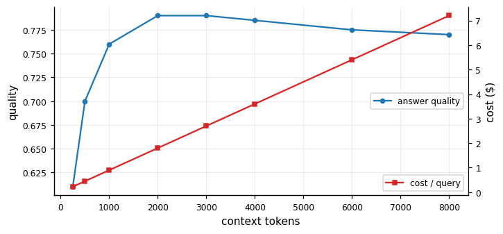
**Ask:** Answer quality and cost per query vs the amount of retrieved context stuffed into the prompt. The team's instinct is 'more context is safer'. Assess.
**Diagnosis:** Quality plateaus around ~2k context tokens (and slightly dips later — distraction/lost-in-middle) while cost grows linearly forever. Beyond the plateau every additional token is pure spend: at the current 8k setting the system pays ~4× the cost of the quality-optimal point for no measurable quality.
**Fix / next step:** Find the knee with this sweep and set the token budget there; combine with reranking and adaptive k (send less when retrieval is confident); track cost-per-quality-point as the efficiency KPI for prompt changes.

**95. The day retrieval forgot** · `H`
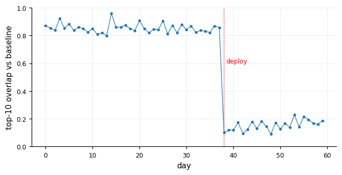
**Ask:** Daily overlap (Jaccard) between each query's current top-10 results and its pre-week baseline, across the fleet. Something shipped on the marked day. Diagnose.
**Diagnosis:** Overlap collapses from ~0.85 to ~0.15 at the deploy: the *embedding model was upgraded but the corpus index was not re-embedded* — queries now live in the new model's space while documents remain in the old one. Similarities become near-meaningless; retrieval is effectively random with a straight face.
**Fix / next step:** Version-lock query and document embeddings together (index metadata carries the model hash; serving asserts match); re-embed the full corpus on any model change, blue/green the index swap; this overlap metric itself is the canary — keep it as a standing monitor.
**Senior tell:** Naming the query-space/index-space version mismatch immediately from the cliff.

**96. The vocabulary that aged** · `M`
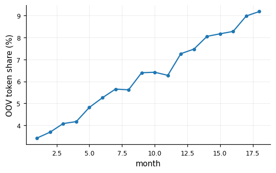
**Ask:** Share of tokens mapped to UNK/OOV by the production text classifier's fixed vocabulary, monthly over 18 months. Interpretation and remedy?
**Diagnosis:** OOV rate has tripled (3%→9%): language drift — new product names, slang, campaign terms — against a vocabulary frozen at training time. The model literally cannot see a growing share of its input; accuracy decays smoothly and invisibly because nothing errors.
**Fix / next step:** Monitor OOV/UNK rate as a first-class drift signal (this plot); retrain/refresh the vocabulary or move to subword tokenization (BPE) which degrades more gracefully; alert thresholds on input-representation coverage, not only on output metrics.

**97. The longer it talks, the more it loops** · `M`
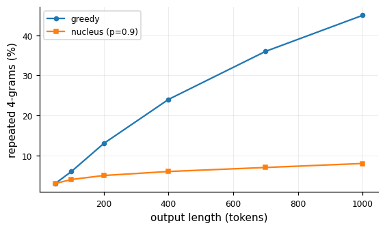
**Ask:** Repetition rate (repeated 4-grams) vs output length for greedy decoding and for nucleus sampling, same model. Product uses greedy for 'consistency'. Assess the trade.
**Diagnosis:** Greedy decoding degenerates with length: repetition climbs past 40% on long outputs (classic neural text degeneration — argmax loops), while nucleus sampling stays flat ~8%. 'Consistency' bought this failure; long-form greedy is the wrong default.
**Fix / next step:** For long generation use nucleus/top-k sampling or repetition penalties (or contrastive decoding); keep temperature 0 only for short structured outputs; add a repetition monitor on generated text as an output-quality guardrail.

**98. 99% on the benchmark** · `H`
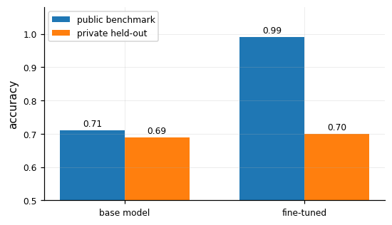
**Ask:** Accuracy of the base model and your fine-tune on a public benchmark, plus on a private held-out set built last month. The team is drafting the announcement. Stop them?
**Diagnosis:** Yes: the fine-tune jumped to 99% on the *public* benchmark while gaining nothing on the private set — the benchmark leaked into the fine-tuning data (it's public text; scrapes and instruction datasets contain it). The 99% measures memorization of test items, not capability.
**Fix / next step:** Run contamination checks (n-gram/substring overlap between training data and benchmark), report the private-set number, and decontaminate the training corpus; adopt the policy that public-benchmark claims require a contamination audit + a private replication.
**Senior tell:** The third bar — private held-out — is the tell; insisting such a bar exists is the senior habit.

**99. Three languages, one headline number** · `M`
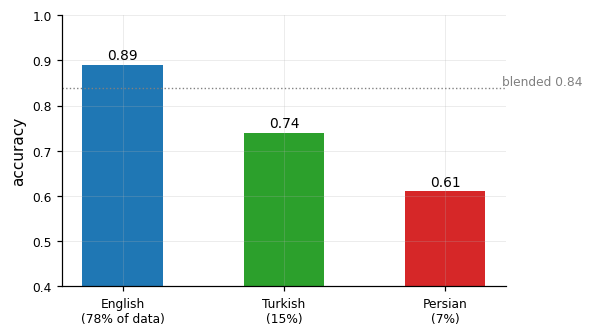
**Ask:** Task accuracy by language for the trilingual assistant; the launch deck says 'accuracy: 84%'. Training-data share is annotated. Critique and fix.
**Diagnosis:** The 84% is EN-dominated (78% of training data): Turkish sits at 74% and Persian at 61% — users of the smallest-data language get a categorically worse product hidden inside a blended average. Data share predicts the gap almost mechanically.
**Fix / next step:** Report per-language metrics as the headline (worst-language as the gate); rebalance: targeted FA/TR data collection, translation-based augmentation, or cross-lingual transfer from a stronger multilingual base; set per-language minimum quality bars for launch.

**100. Where the milliseconds live** · `M`
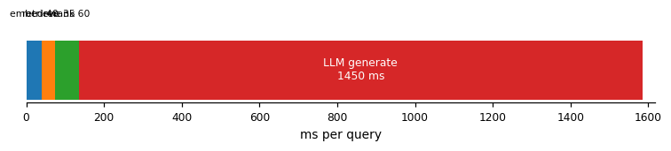
**Ask:** Latency breakdown of the RAG pipeline per query. The team spent last sprint optimizing the vector index (retrieve stage). Evaluate that allocation.
**Diagnosis:** Generation dominates: ~1,450 ms of a ~1,585 ms budget is the LLM call; retrieval is 35 ms. Halving retrieval saves ~1% end-to-end — the sprint optimized the wrong box. Amdahl's law applies to pipelines: optimize the dominant stage.
**Fix / next step:** Attack generation: smaller/distilled model for easy queries (router), shorter prompts (see the context-budget plot), streaming for perceived latency, caching frequent answers, speculative decoding. Keep this breakdown on the dashboard so effort follows milliseconds.

**101. Quality fell off a cliff at 8k** · `H`
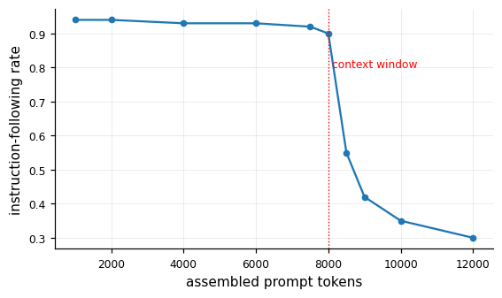
**Ask:** Instruction-following rate vs total assembled prompt length (system prompt + retrieved context + query). Model context window: 8k. No errors in the logs. Diagnose.
**Diagnosis:** Silent truncation at the window: once assembled prompts exceed 8k, the front of the prompt — where the *system instructions* live — gets cut (or the tail context does, depending on assembly), so the model stops following instructions precisely for the longest, hardest queries. No exception is raised; the API happily processes the truncated prompt.
**Fix / next step:** Assert assembled length < window minus generation budget and fail loudly (or trim *context*, never instructions, with an explicit strategy); log assembled-length distribution; the cliff position in this plot identifying the window size is the fingerprint of this bug.
**Senior tell:** Knowing truncation is silent and asking which *end* the assembly code cuts.

**102. The judge prefers whoever speaks first** · `M`
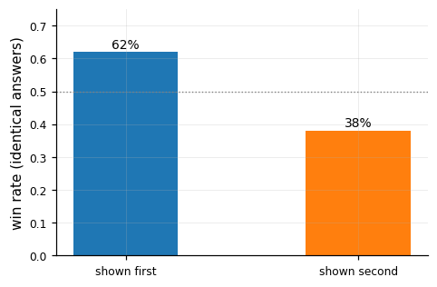
**Ask:** Pairwise LLM-judge win rates when the *identical* pair of answers is shown in both orders. What does this measure, and what must change in the eval harness?
**Diagnosis:** Position bias: the same answer wins 62% when shown first and 38% when shown second — a 24-point swing from ordering alone. Any pairwise eval without position control is measuring slot preference mixed with quality; small model deltas drown in it.
**Fix / next step:** Randomize or, better, evaluate both orders and aggregate (count only consistent wins, or average); report the position-bias magnitude of the judge as harness metadata; consider judges/prompts designed to reduce it. Same discipline as randomizing treatment order in human studies.

---

## Domain F — Statistics, A/B Testing & Distributions

**103. The p-value that dipped** · `H`
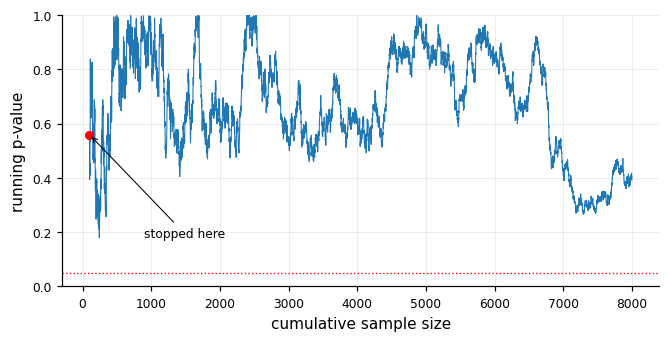
**Ask:** Running p-value of an A/B test as data accumulates. The PM stopped the test at the marked point ('significant!') and shipped. Assess.
**Diagnosis:** Optional stopping: under a true null the p-value trajectory is a random walk that will wander below 0.05 in many experiments if you watch it continuously — stopping at the first dip inflates the false-positive rate several-fold. The dip at n≈3,400 followed by recovery is exactly that pattern; the 'significance' was manufactured by the stopping rule.
**Fix / next step:** Pre-register the sample size and analyze once; or use methods built for peeking — group-sequential boundaries (alpha spending) or always-valid inference (mSPRT/confidence sequences). Also fix the dashboard: hide raw running p-values or overlay the sequential boundary.
**Senior tell:** Naming the fix as procedural (pre-registration/sequential design), not 'run it longer'.

**104. The lift that faded** · `M`
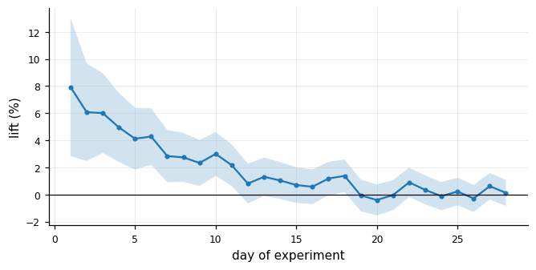
**Ask:** Daily treatment lift (with CI band) over a 4-week A/B test of a redesigned feature. Leadership wants to ship based on week 1. Advise.
**Diagnosis:** A novelty effect: +8% lift in the first days decays toward ~0 by week 3–4 as users' curiosity about the new thing wears off. Week-1 numbers measure novelty, not durable value; shipping on them bakes in a benefit that won't persist (the mirror image — primacy effect — makes good changes look bad early).
**Fix / next step:** Run through the novelty horizon; estimate lift on *late* cohorts or repeat-exposure users; segment new vs existing users (new users can't feel novelty); pre-specify the decision window. If the late-window CI covers zero, the honest answer is 'no durable effect'.

**105. The trend that reverses** · `H`
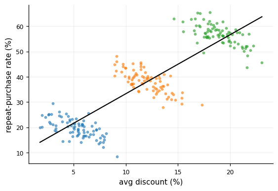
**Ask:** Discount rate vs repeat-purchase rate across customer accounts, colored by account size tier; the black line is the pooled OLS fit. Sales concludes 'discounts drive loyalty'. Evaluate.
**Diagnosis:** Simpson's paradox: pooled across tiers the slope is positive, but *within every tier* the relationship is negative — bigger accounts get both more discount and (independently) buy more often, confounding the pooled view. The causal claim from the pooled line is exactly backwards for any given account.
**Fix / next step:** Stratify or model with tier fixed effects / mixed models; better, frame causally (confounder: account size) and adjust; best, randomize discounts if the decision matters. Any pooled scatter across heterogeneous groups deserves this check before a conclusion ships.
**Senior tell:** Drawing the within-group slopes immediately — and naming the confounder, not just the paradox.

**106. Engagement 'grows' with tenure** · `H`
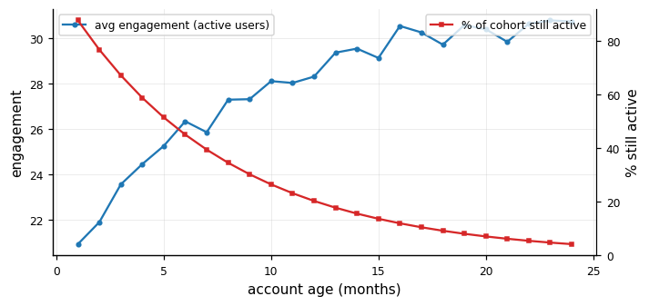
**Ask:** Average engagement of active users by account age (blue) and the share of the original cohort still active (red, right axis). Product claims 'users love us more over time'. Assess.
**Diagnosis:** Survivorship bias: engagement is averaged over *remaining* users only, while the cohort shrinks to ~10% by month 24 — disengaged users leave, mechanically raising the average of who's left. The blue curve mostly measures selection, not growth in love; the composition of the denominator changes every month.
**Fix / next step:** Analyze fixed cohorts (same users tracked over time) or model engagement jointly with retention; report retention curves alongside any per-active-user metric; the honest headline is the red curve.

**107. Train vs production** · `M`
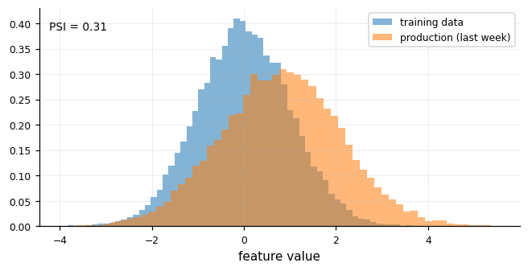
**Ask:** Distribution of a key feature at training time vs live traffic last week (PSI annotated). The model's accuracy metric hasn't been computed yet (labels lag 30 days). Act now or wait?
**Diagnosis:** Covariate drift: production inputs have shifted right and widened; PSI = 0.31 is well past the conventional 0.25 'significant shift' alarm. With labels lagging a month, waiting for accuracy means flying blind for weeks while the model scores a population it never saw.
**Fix / next step:** Act on input drift now: investigate cause (upstream schema change? campaign? seasonality? new segment?), check other features, tighten monitoring on prediction distribution and business proxies; retrain/recalibrate on recent data if cause is legitimate population change. Also verify it's not a *pipeline bug* — drift alarms catch broken joins as often as real drift.
**Senior tell:** First ruling out an upstream data bug before retraining on 'drifted' data.

**108. Two humps** · `M`
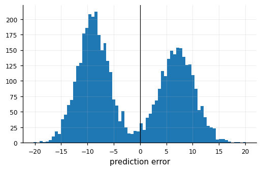
**Ask:** Histogram of prediction errors for the deployed regression model. It's not Gaussian. What is the shape telling you?
**Diagnosis:** Bimodal errors: the model is systematically low for one subpopulation and high for another — two regimes are being averaged by a single model that lacks the feature separating them (e.g., B2B vs B2C accounts, two plants, promo vs non-promo weeks). Aggregate error metrics look mediocre-but-stable while both segments are served badly.
**Fix / next step:** Identify the hidden segment: color/split this histogram by candidate variables until the humps separate; then add the segment feature (or interaction), or fit segment models. A mixture in the *errors* is a missing variable in the *features*.

**109. Big effects, small samples** · `H`
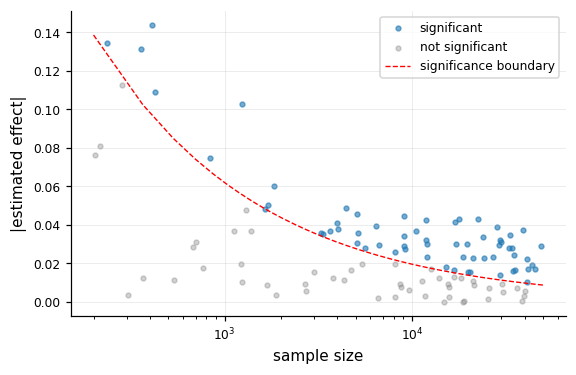
**Ask:** Estimated effect size vs sample size for 60 experiments the team ran last year (dashed: significance boundary). What pattern do you see, and what does it imply about the team's 'wins'?
**Diagnosis:** A funnel with a missing corner: at small n only *large* estimated effects appear (small-but-significant ones are impossible, and non-significant small-n results were often not followed up), while big-n experiments cluster near small true effects. Implication: the portfolio's headline 'wins' from small tests are inflated — the winner's curse; shipped effects will regress toward much smaller real impact.
**Fix / next step:** Expect shrinkage: re-estimate winners with follow-up/holdout data or empirical-Bayes shrinkage; power experiments properly so real effects are detectable at honest sizes; log *all* results (no file-drawer) and track post-ship realized lift vs predicted — the calibration curve of the experimentation program.
**Senior tell:** Predicting post-launch regression to smaller effects — and proposing to *measure* it.

**110. The launch that 'worked'** · `H`
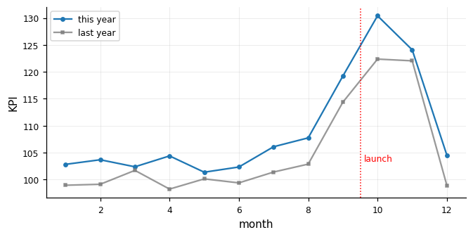
**Ask:** KPI around a feature launch (marker), with the same KPI from last year overlaid. The launch review deck shows only the blue line. Assess the claimed +30% impact.
**Diagnosis:** The jump coincides with the seasonal peak that happens every year — last year's line shows nearly the same rise with no launch at all. A naive pre/post comparison attributes seasonality to the feature; the honest incremental effect is the small gap between the two curves, not the +30% step.
**Fix / next step:** Use a control: holdout regions/users (diff-in-diff), or at minimum a seasonally-adjusted counterfactual (forecast from pre-period, or causal-impact style structural model). Rule: no pre/post claim near known seasonality without a control series in the same plot.

**111. 'Not significant' ≠ 'no effect'** · `H`
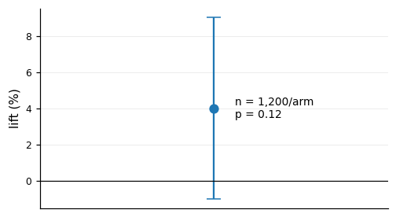
**Ask:** A/B result: +4.0% lift, 95% CI [−1.0%, +9.0%], p = 0.12, n = 1,200/arm. The team logs it as 'feature has no effect' and moves on. Correct the record.
**Diagnosis:** The CI is consistent with anything from a 1% loss to a 9% gain — the experiment was *underpowered* to detect the plausible effect sizes, so it returned ignorance, not absence. 'No significant effect' was translated to 'no effect', which the data cannot support; a +4% true lift may have been discarded.
**Fix / next step:** Run a power analysis before launching (n required to detect the minimum effect worth acting on); for this result: extend the test or pool with replications; institutionally, ban 'no effect' conclusions without a CI narrow enough to exclude meaningful effects.
**Senior tell:** Reading the CI width, not the p-value, as the experiment's information content.

**112. One green cell** · `M`
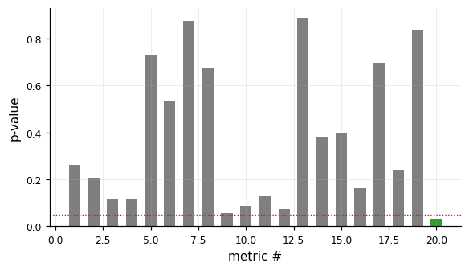
**Ask:** The experiment tracked 20 metrics; the dashboard highlights the one with p < 0.05 and the PM wants to ship on it. Assess.
**Diagnosis:** With 20 independent metrics at α = 0.05, the expected number of false positives under a global null is exactly 1 — the dashboard is showing you the multiplicity artifact it was built to produce. A single uncorrected green cell among 20 is what 'nothing happened' looks like.
**Fix / next step:** Pre-register one primary metric (ship/no-ship) and treat the rest as exploratory; correct families of tests (Benjamini–Hochberg); if the green metric matters, replicate it as the primary in a follow-up. Dashboards should display corrected significance.
**Senior tell:** Saying 'expected false positives = 20 × 0.05 = 1' before anything else.

**113. Treatment won by robbing control** · `H`
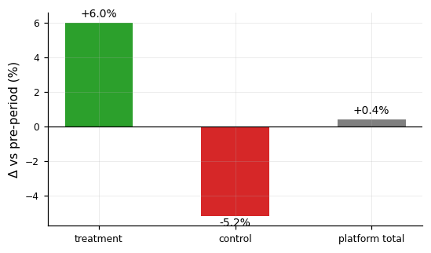
**Ask:** Marketplace A/B of a promotion: sales vs pre-period for treatment and control users, plus the platform total. Treatment +6%! Ship?
**Diagnosis:** Control *declined* ~5% while total is ~flat: interference/cannibalization — treated users' extra purchases came partly at control users' expense (shared inventory, seller attention, ranking slots). SUTVA is violated; the naive treatment–control delta (+11 points of gap) wildly overstates the true platform effect (~0).
**Fix / next step:** Use interference-robust designs: cluster/geo randomization, switchbacks (time-sliced), or marketplace-level budget splits; estimate total-platform effect, not user-level delta; any two-sided-market experiment needs an interference story before its numbers are believed.

**114. Coaching the bottom decile** · `H`
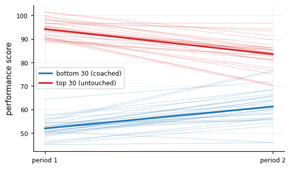
**Ask:** The 30 worst-performing sales reps got coaching; here's their before/after vs the (untouched) 30 best. Ops: 'coaching works, the bottom improved 18%'. Assess.
**Diagnosis:** Regression to the mean: selecting extremes guarantees movement toward the average on remeasurement — note the *untouched* top group declined by a similar magnitude. Performance = skill + noise; conditioning on an extreme observed value selects extreme noise, which doesn't persist. The 18% conflates this artifact with any real coaching effect.
**Fix / next step:** Randomize: split the bottom decile into coached vs not and compare their *second*-period means; or use shrinkage estimates of true skill for selection. Any intervention targeted at extremes must be evaluated against a same-selection control.
**Senior tell:** Pointing at the declining top group as the built-in falsification.

**115. Randomized by user, analyzed by event** · `H`
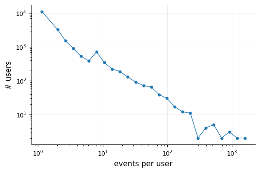
**Ask:** Distribution of events per user in the experiment (log-log). The analysis computed the t-test over *events*. Why are the reported confidence intervals fiction?
**Diagnosis:** Events per user is heavy-tailed (a few users generate thousands of events): events from the same user are strongly correlated, so treating them as independent observations massively overstates the effective sample size — CIs computed at event level are far too narrow, p-values far too small. The unit of randomization (user) and unit of analysis (event) don't match.
**Fix / next step:** Analyze at the randomization unit: per-user aggregates, or the delta method / cluster-robust standard errors for ratio metrics; simulate/AA-test the pipeline to verify false-positive rates ≈ α. Mismatched units is among the most common silent A/B bugs.
**Senior tell:** Naming the unit-of-analysis mismatch and reaching for delta method/clustered SEs.

**116. 48.7% is not 50%** · `H`
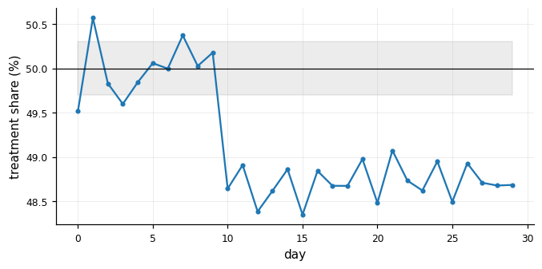
**Ask:** Daily share of users assigned to treatment in a 50/50 experiment (with expected band). The metric readout looks great. What must happen before anyone reads metrics?
**Diagnosis:** Sample-ratio mismatch (SRM): assignment share has drifted to ~48.7%, far outside binomial noise for this volume — the randomization/logging is broken (bot filtering hitting one arm, redirects dropping users, caching, ID collisions). Whatever caused it is almost certainly *correlated with the outcome*, so every metric is biased in unknown ways.
**Fix / next step:** Automated SRM chi-square check as a gate on every experiment readout (fail = investigate, don't analyze); find the mechanism (instrumentation funnel by arm); rerun the experiment after the fix. SRM is the smoke alarm of experimentation — never read metrics through it.
**Senior tell:** Refusing to interpret any metric until SRM passes.

**117. The whale in the treatment arm** · `M`
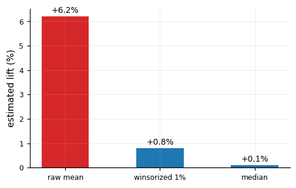
**Ask:** Estimated lift of the same experiment under raw means, 1% winsorization, and medians. Which number is real?
**Diagnosis:** The +6.2% raw lift collapses to +0.8% winsorized and +0.1% at the median: the entire effect lives in a handful of extreme users (possibly one whale who landed in treatment by chance). The raw mean answers 'what happened in this sample', not 'what will happen if we ship'.
**Fix / next step:** For heavy-tailed metrics pre-specify robust estimators (winsorized/trimmed means) or analyze log-transformed values; check per-user contribution concentration; if a whale drives it, the honest readout is 'no reliable effect'. Sensitivity analysis across estimators should ship with every readout.

**118. Diff-in-diff without the parallel** · `H`
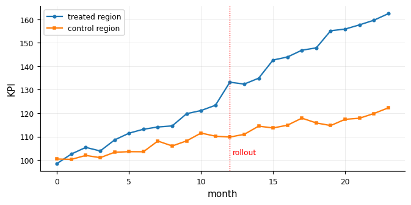
**Ask:** Treated and control regions' KPI around a rollout (marker). The analyst computed diff-in-diff on the pre/post means. What assumption does the *pre-period* already falsify?
**Diagnosis:** Parallel trends: the treated region was already growing faster than control *before* the rollout — the pre-period slopes visibly diverge. DiD attributes any post-period divergence to treatment only if the groups would have moved in parallel absent it; here the pre-trend alone predicts most of the post gap.
**Fix / next step:** Test pre-trends explicitly (event-study plot with leads/lags); use synthetic control or matching on trends to build a credible counterfactual; or difference out region-specific trends. A DiD without a pre-trend check is an assumption wearing a result's clothes.

---

## Domain G — Clustering & Unsupervised Learning

**119. Looking for an elbow that isn't there** · `M`
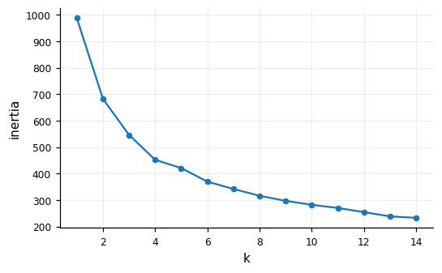
**Ask:** K-means inertia vs k for the customer base. The team has spent two meetings arguing whether the elbow is at 4 or 6. Resolve it.
**Diagnosis:** There is no elbow: inertia decreases smoothly (it *always* decreases with k by construction), and this curve's gentle slope means the data has no strongly separated cluster structure at any k — the argument is about reading tea leaves. Inertia alone cannot choose k here.
**Fix / next step:** Use structure-sensitive criteria: silhouette/gap statistic, stability across resamples (do the same customers co-cluster?), and — decisive in business settings — actionability: pick the k whose segments the business can name and treat differently. Also question whether hard clustering fits at all (continuous spectrum → embeddings + soft assignment).

**120. The trash-bin cluster** · `M`
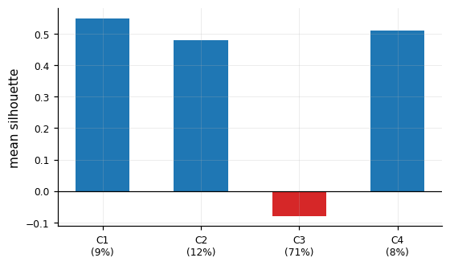
**Ask:** Silhouette score by cluster (bar) with cluster sizes annotated, from the segmentation shipped to marketing. Assess the segmentation's health.
**Diagnosis:** Cluster 3 holds 71% of customers with a *negative* silhouette — it isn't a segment, it's the residual bin where the algorithm dumped everything unstructured, while the small clean clusters carry the structure. Marketing is 'targeting' a segment that has no internal coherence.
**Fix / next step:** Rework features (the current space doesn't separate the mass), try density-based methods that permit 'noise' labels, or accept a hierarchy: model the big blob separately/subdivide it. Report size-weighted silhouette and per-cluster coherence before shipping any segmentation.
**Senior tell:** Reading cluster *sizes* together with quality — the 71% bar is the finding.

**121. Clusters in one dimension** · `M`
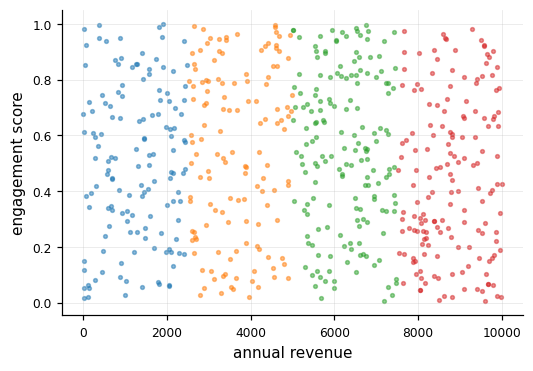
**Ask:** Customer clusters (colors) from k-means on two features: annual revenue (x, 0–10,000) and engagement score (y, 0–1). What did the algorithm actually cluster on?
**Diagnosis:** Only revenue: the clusters are perfect vertical bands because k-means uses Euclidean distance and revenue's scale is ~10⁴× engagement's — the y-axis contributes nothing to distances. The 'segmentation' is a revenue binning wearing a clustering costume; engagement structure is invisible.
**Fix / next step:** Standardize/scale features before any distance-based method (and choose scaling deliberately — it *is* the feature weighting); afterwards check that clusters vary along every feature that's supposed to matter; consider Gower/mixed-type distances when features are heterogeneous.

**122. Round pegs, crescent holes** · `M`
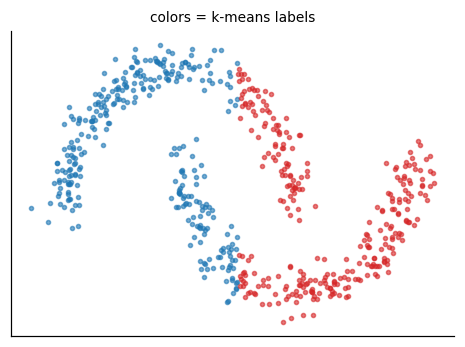
**Ask:** K-means (k=2) coloring of this dataset. The algorithm converged fine. What's wrong, and what family of methods fixes it?
**Diagnosis:** The data is two interleaved crescents; k-means assumes convex, roughly spherical clusters around centroids, so it slices the moons with a straight boundary — each color contains half of each true cluster. Convergence says nothing about model-data fit.
**Fix / next step:** Use methods that follow density/connectivity: DBSCAN/HDBSCAN, spectral clustering, or GMMs with enough components approximating the shape; or engineer a space where clusters become convex (kernel/embedding). Always scatter-check cluster shape assumptions in 2D projections before trusting labels.

**123. Same data, different clusters every run** · `H`
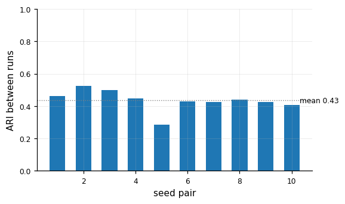
**Ask:** Adjusted Rand Index between cluster assignments from 10 pairs of runs — same data, same k, different random seeds. The segments feed monthly business reports. Assess.
**Diagnosis:** Mean ARI ≈ 0.42: the clustering is unstable — a different seed reshuffles which customers share a segment, so month-over-month 'segment migration' reports are substantially measuring RNG, not customer behavior. Weak/overlapping structure plus k-means' sensitivity to initialization.
**Fix / next step:** Stabilize: many n_init with best-of selection, or consensus clustering; *persist* the solution — fix the model and assign new data to existing segments rather than re-clustering; when retraining is necessary, align labels across runs (Hungarian matching on centroids) and report assignment churn as a metric. If ARI stays low, the structure may not support hard segments at all.
**Senior tell:** Separating 'recluster every month' from 'assign to persisted segments' — the operational fix.

**124. Clusters from nothing** · `H`
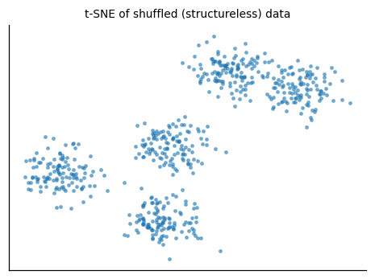
**Ask:** t-SNE projection of feature vectors that were *row-shuffled within each column* (all real structure destroyed). The junior sees 'five clear customer types'. Deliver the lesson.
**Diagnosis:** The apparent clusters are projection artifacts: t-SNE/UMAP optimize local neighborhoods and readily manufacture compact blobs from structureless data (perplexity/n_neighbors artifacts). A projection can *suggest* structure but can never *certify* it — especially not cluster count or separation.
**Fix / next step:** Validate structure where it lives: cluster metrics computed in the original space, stability under resampling/seeds, and the shuffled-data null exactly as done here (if noise looks the same, the finding is nothing); tune perplexity and show multiple projections; treat 2-D pictures as illustrations, never evidence.
**Senior tell:** The shuffled-null control itself — strong candidates propose it before being shown it.

---

## How to score these

| Signal | Weak (1–2) | Strong senior (4–5) |
|---|---|---|
| **Shape reading** | Describes the obvious ("loss goes down then up") | Names the pathology precisely (overfit at epoch 40, sawtooth = annealing schedule, funnel = heteroscedasticity) |
| **Mechanism** | Pattern-matches a memorized label | Explains *why* the shape arises from the data/loss/procedure |
| **Falsification** | One hypothesis, full confidence | Offers 2–3 hypotheses and the cheapest experiment that separates them |
| **Metric skepticism** | Trusts the good-looking number | Asks what the metric hides (prevalence, segment, operating depth, survivors, season) |
| **Production instinct** | Stops at diagnosis | Names the monitor/alert that would have caught it before a human saw the plot |

**Recommended use.** 3–4 figures per 45-minute round, mixing domains. Lead with the candidate's home domain, then one far from it. The strongest single discriminators in this bank: the plots with *two or more* valid explanations (29, 30, 46, 103) and the ones whose 'good news' is the bug (49, 59, 66, 106) — juniors pick one story and commit; seniors enumerate hypotheses and design the cheap test that separates them.
